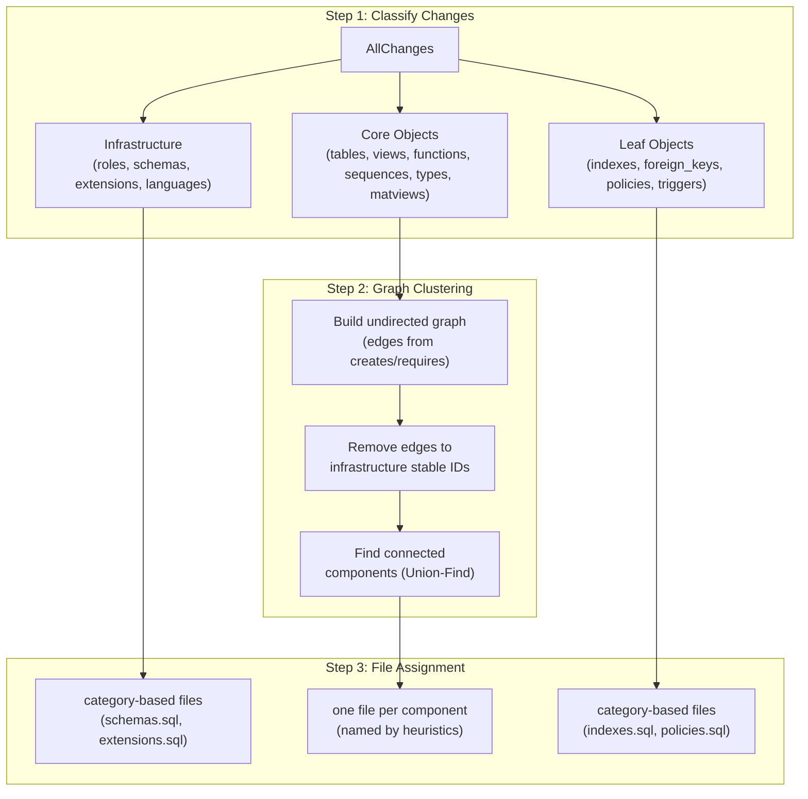

# Graph-Based Declarative Schema Grouping

## Problem

- **Simple mode**: Lumps tables, views, functions, sequences, matviews, and aggregates into a single `tables_and_functions.sql` (~10k lines) because of circular dependencies between them.
- **Detailed mode**: Creates one file per database object, which for a Supabase-scale DB means hundreds of files.

The user wants a middle ground: the **largest independent groups** of mutually-dependent changes, each isolated into its own file.

## Core Idea: Connected Components on the Dependency Graph

Each `Change` object has:

- `creates: string[]` -- stable IDs it produces
- `requires: string[]` -- stable IDs it needs beforehand

Two changes belong in the same file if there is a transitive dependency path between them. This is exactly the **connected components** problem on the undirected dependency graph.




### Why connected components?

- They give the **maximal independent groups**: you cannot make a group larger without introducing cross-file dependencies.
- Files within different components are completely independent and can be applied in any order.
- Within a component, the existing topological sort determines internal statement order.
- Algorithm is O(V+E) using Union-Find -- trivial performance cost.

## Algorithm Detail

1. **Classify changes** into three tiers:
  - **Infrastructure** (roles, schemas, extensions, languages, FDWs, publications, subscriptions, event triggers): Always get their own category-based files, same as simple mode. These are "universal" dependencies.
  - **Core** (tables, views, matviews, functions/procedures, aggregates, sequences, types, domains, collations): These enter the graph clustering.
  - **Leaf** (indexes, foreign keys, policies, triggers, rules): Always get their own category-based files. These are terminal nodes -- they depend on core objects but nothing depends on them.
2. **Build undirected graph** on core changes:
  - For each core change, collect `creates` and `requires` stable IDs.
  - Build a mapping: `stableId -> Set<changeIndex>` (from creates).
  - For each `requires` link, add an undirected edge between the requiring change and every change that creates the required ID.
  - **Exclude** edges to infrastructure stable IDs (schema:*, role:*, extension:*) -- these are universal dependencies that would collapse everything into one component.
3. **Find connected components** using Union-Find.
4. **Apply size heuristics** (configurable thresholds):
  - If a component exceeds `maxGroupSize` (e.g., 200 changes), sub-split by schema name. If still too large, further split by object type within each schema.
  - Components below `minGroupSize` (e.g., 3 changes) can optionally be merged into a catch-all file per schema, or left as-is.
5. **Name each file** using heuristics:
  - Analyze the component's schemas and object types.
  - Single schema + single dominant table: `{schema}/{table}.sql`
  - Single schema + multiple related objects: `{schema}/{root_object_name}.sql` (named after the "root" -- the object with most dependents)
  - Single schema + mixed types, no clear root: `{schema}/objects_{N}.sql`
  - Multiple schemas: `cross_schema/{descriptive_name}.sql`
  - Infrastructure and leaf files reuse simple mode naming.
6. **Order files**: Infrastructure files first (by CATEGORY_PRIORITY), then component files (by min topological index within each component), then leaf files (by CATEGORY_PRIORITY).

## Feature 2: FK Inlining and Column Annotations (All Modes)

Currently, all constraints (including FKs) are serialized as separate `ALTER TABLE ADD CONSTRAINT` statements in a dedicated `foreign_keys.sql` file. This makes CREATE TABLE statements opaque -- you can't see relationships without cross-referencing another file.

### Approach

At export time (post-serialization), a new **FK inlining pass** processes the sorted changes:

1. **Identify FK constraint changes**: Find all `AlterTableAddConstraint` changes where `constraint.constraint_type === "f"`.
2. **Determine inlineability**: An FK is safe to inline if the referenced table's CREATE TABLE appears **before** the referencing table's CREATE TABLE in the topological order. This is checked by looking up the referenced table's stable ID in the sorted changes array.
3. **For safe FKs -- inline into CREATE TABLE**:
  - Remove the FK change from the `foreign_keys` file group.
  - Append the constraint as a table-level `CONSTRAINT` clause inside the CREATE TABLE parentheses. We post-process the CREATE TABLE SQL string: find the closing `)` and insert the constraint before it.
  - Example result:
    ```sql
    CREATE TABLE public.orders (
        id bigint GENERATED ALWAYS AS IDENTITY NOT NULL,
        user_id bigint NOT NULL,
        CONSTRAINT orders_user_id_fkey FOREIGN KEY (user_id) REFERENCES auth.users(id) ON DELETE CASCADE
    )
    ```
4. **For unsafe FKs (circular refs) -- add column comments**:
  - The FK constraint remains in `foreign_keys.sql` as a separate ALTER TABLE statement.
  - Add a SQL comment on the referencing column(s) in the CREATE TABLE statement.
  - For single-column FKs: append `-- fk: schema.table(column)` to the column definition line.
  - For multi-column FKs: add a comment line above the first column.
  - Example result:
    ```sql
    CREATE TABLE public.nodes (
        id bigint GENERATED ALWAYS AS IDENTITY NOT NULL,
        parent_id bigint, -- fk: public.nodes(id) [deferred, see foreign_keys.sql]
        name text NOT NULL
    )
    ```
5. **Empty FK file cleanup**: If all FKs in a file are inlined, remove the now-empty `foreign_keys.sql` file from the output.

### Key data available on `TableConstraintProps`:

- `key_columns: string[]` -- columns on the referencing table
- `foreign_key_schema, foreign_key_table` -- the referenced table
- `foreign_key_columns: string[]` -- the referenced columns
- `definition: string` -- full SQL from `pg_get_constraintdef()` (e.g., `FOREIGN KEY (user_id) REFERENCES auth.users(id) ON DELETE CASCADE`)
- `on_update, on_delete, match_type` -- FK behavior
- `deferrable, initially_deferred` -- deferral status

### Configuration

New option on `ExportOptions`:

```typescript
inlineForeignKeys?: boolean; // default: true
```

When `true`, the FK inlining pass runs after file grouping and before SQL formatting. Works with all modes (simple, detailed, graph).

## Files to Create/Modify

### New: `[src/core/export/graph-file-mapper.ts](src/core/export/graph-file-mapper.ts)`

Core of the graph grouping logic. Contains:

- `groupChangesByGraph(changes, catalogDepends, options)` -- the main function
- `buildUndirectedDependencyGraph(changes)` -- builds adjacency from creates/requires
- `findConnectedComponents(graph)` -- Union-Find implementation
- `splitOversizedComponent(component, maxSize)` -- schema-based splitting heuristic
- `generateComponentFileName(component)` -- naming heuristic
- Infrastructure/leaf stable ID detection helpers

### New: `[src/core/export/fk-inliner.ts](src/core/export/fk-inliner.ts)`

FK inlining and annotation pass. Contains:

- `inlineForeignKeys(groups, sortedChanges)` -- main entry point; operates on `FileGroup[]` after grouping
- `findInlineableFKs(fkChanges, sortedChanges)` -- determines which FKs can be safely inlined (referenced table appears earlier in topological order)
- `inlineFKIntoCreateTable(createTableSql, constraint)` -- string manipulation to insert CONSTRAINT clause into CREATE TABLE
- `annotateFKColumn(createTableSql, constraint)` -- adds `-- fk: schema.table(column)` comments for non-inlineable FKs
- Returns modified `FileGroup[]` with FK changes moved/removed and CREATE TABLE SQL updated

### Modify: `[src/core/export/types.ts](src/core/export/types.ts)`

- Add `"graph"` to `ExportMode` type.
- Add `GraphExportOptions` interface for tuning parameters (maxGroupSize, minGroupSize).
- Add `inlineForeignKeys?: boolean` to `ExportOptions` (or a shared options type).

### Modify: `[src/core/export/index.ts](src/core/export/index.ts)`

- Import the new graph grouper and FK inliner.
- When `mode === "graph"`, call `groupChangesByGraph()` instead of the mapper + `groupChangesByFile()` pattern.
- Pass `catalogDepends` from the plan context (`ctx.branchCatalog.depends`).
- After grouping (in all modes), run the FK inlining pass if `inlineForeignKeys !== false`.

### Modify: `[scripts/declarative-export.ts](scripts/declarative-export.ts)`

- Read `MODE` from env var: `process.env.MODE ?? "graph"` (so `MODE=simple`, `MODE=detailed`, and `MODE=graph` all work).
- Default to `"graph"` when no MODE is set.
- Pass `inlineForeignKeys: true` (default) alongside the mode.

## Key Code Leverage

- **Dependency data already exists**: Each `Change` (via `[BaseChange](src/core/objects/base.change.ts)`) exposes `creates`, `requires`, and `drops`. The catalog also provides `pg_depend` rows. The graph builder in `[src/core/sort/graph-builder.ts](src/core/sort/graph-builder.ts)` already converts these to constraints -- we can reuse `buildGraphData()` and its index maps.
- **Topological sort is already done**: The `sortedChanges` array from `createPlan()` is already topologically sorted. The graph grouper receives pre-sorted changes, so within-file ordering is preserved automatically.
- **Existing grouper pattern**: The output (`FileGroup[]`) matches the existing interface in `[src/core/export/grouper.ts](src/core/export/grouper.ts)`, so the rest of the export pipeline (SQL formatting, order prefixing, etc.) works unchanged.

## Example Outcome

For a Supabase database, instead of:

**Simple mode (current)**:

- `tables_and_functions.sql` (9,934 lines -- everything mashed together)
- `foreign_keys.sql` (separate, no context in CREATE TABLE)
- `indexes.sql`, `policies.sql`, etc.

**Graph mode with FK inlining (proposed)**:

- `schemas.sql`
- `extensions.sql`
- `types.sql`
- `public/users.sql` (users table + identity sequence + helper functions)
- `public/orders.sql` (orders table + its sequences, with inlined FK to users)
- `public/analytics.sql` (views + matviews + their dependent functions)
- `auth/users.sql` (auth schema cluster)
- `indexes.sql`
- `foreign_keys.sql` (only circular/deferred FKs that couldn't be inlined)
- `policies.sql`

**FK inlining example** -- orders table with FK to users inlined:

```sql
CREATE TABLE public.orders (
    id bigint GENERATED ALWAYS AS IDENTITY NOT NULL,
    user_id bigint NOT NULL,
    total numeric(10, 2) NOT NULL,
    CONSTRAINT orders_pkey PRIMARY KEY (id),
    CONSTRAINT orders_user_id_fkey FOREIGN KEY (user_id) REFERENCES public.users(id) ON DELETE CASCADE
)
```

**FK annotation example** -- circular reference kept separate with comment:

```sql
CREATE TABLE public.nodes (
    id bigint GENERATED ALWAYS AS IDENTITY NOT NULL,
    parent_id bigint, -- fk: public.nodes(id) [see foreign_keys.sql]
    name text NOT NULL
)
```

## Validation: Dogfooding Roundtrip Test

The existing `[scripts/declarative-schema-supabase-dogfooding.sh](scripts/declarative-schema-supabase-dogfooding.sh)` is the canary test. It:

1. Exports declarative schema from a real Supabase platform-db source
2. Starts a clean platform-db container
3. Applies all SQL files in `order.json` order with `ON_ERROR_STOP=1`
4. Verifies roundtrip: diffs the applied DB against the original source, expecting 0 changes

**Current baselines** (1934 changes):

- `MODE=simple` -- 12 files, roundtrip OK
- `MODE=detailed` -- 856 files, roundtrip OK

**Target**: `MODE=graph` must also pass with 0 changes. Expected file count should be somewhere between 12 and 856 (likely 30-150 depending on how connected the Supabase schema graph is).

The dogfooding script already supports `MODE` via the export script. After the implementation, we run:

```bash
MODE=graph ./scripts/declarative-schema-supabase-dogfooding.sh
```

**Success criteria**:

- "All files applied successfully." -- no SQL errors during apply
- "Verification passed: 0 changes" -- roundtrip is lossless
- File count is reasonable (significantly fewer than detailed, significantly more than simple)
- FK constraints visible in CREATE TABLE statements where safe

