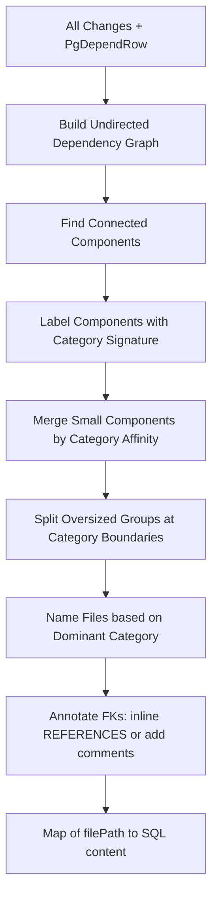

# Graph-Based Declarative Schema File Partitioner

## Problem

The current export system has two modes:

- **Simple**: groups most SQL into a single `tables_and_functions.sql` file (9900+ lines)
- **Detailed**: creates one file per object (explosion of tiny files)

Neither is ideal. We need a middle ground that **finds naturally isolated groups of mutually-dependent changes** and maps them to files.

## Core Insight

The existing dependency system already provides everything needed:

- Each `Change` has `creates`, `requires`, and `drops` stable ID arrays
- `PgDependRow[]` from `pg_depend` provides catalog-level dependencies
- `[buildGraphData()](src/core/sort/graph-builder.ts)` and `[convertCatalogDependenciesToConstraints()](src/core/sort/graph-builder.ts)` already build the dependency graph

**The key observation**: if we build an **undirected** dependency graph between changes and find its **connected components**, each component represents a maximal set of changes that MUST be co-located. Changes in different components can be freely placed in separate files.

## Algorithm




### Step 1: Build Undirected Dependency Graph

Reuse the existing infrastructure from `[src/core/sort/graph-builder.ts](src/core/sort/graph-builder.ts)`:

- Call `buildGraphData()` to get `changeIndexesByCreatedId` and `explicitRequirementSets`
- Call `convertCatalogDependenciesToConstraints()` for pg_depend edges
- Call `convertExplicitRequirementsToConstraints()` for explicit edges
- Convert all directed edges to undirected edges

### Step 2: Find Connected Components

Standard Union-Find (disjoint set) algorithm on the undirected graph:

- O(n * alpha(n)) complexity where alpha is the inverse Ackermann function
- Each component = an "atomic unit" that cannot be split across files

### Step 3: Label Components with Category Signature

For each component, compute:

- `dominantSchema`: most frequent schema (from `[getObjectSchema()](src/core/plan/serialize.ts)`)
- `dominantObjectType`: most frequent objectType
- `categories`: set of all object types present (table, index, trigger, function, etc.)
- `size`: total number of changes (proxy for SQL line count)

### Step 4: Merge Small Components by Category Affinity

Group components using a scoring function that considers:

- **Same schema** (high affinity)
- **Compatible object types** (e.g., a table + its sequences, or functions in the same schema)
- **Size threshold**: don't merge if the resulting group exceeds `MAX_CHANGES_PER_FILE` (configurable, default ~200 changes)

Priority order for merging:

1. Components in the same schema with the same dominant object type
2. Components in the same schema with related object types (table + sequence, view + rule)
3. Schema-less cluster objects by type (roles together, extensions together)

### Step 5: Split Oversized Groups

If a connected component is too large (e.g., a schema where everything depends on everything):

- Identify **bridge edges** (articulation edges) -- removing them disconnects the component
- If cutting bridges produces reasonable sizes, split there
- Otherwise, try splitting metadata (comments, privileges, default_privileges) into a companion file since these are leaf nodes in the dependency graph
- Last resort: accept the large file (it's genuinely one tightly-coupled unit)

### Step 6: File Naming Heuristics

Use the category signature to generate readable file names:

- **Directory structure**: flat (no schema subdirectories) with numeric prefixes for ordering
- **Naming rules**:
  - Cluster objects: `000001_roles.sql`, `000002_extensions.sql`
  - Schema objects: `000010_public_tables.sql`, `000011_public_functions.sql`
  - Mixed: `000015_auth_tables_and_types.sql`
  - Metadata companion: `000016_auth_tables_privileges.sql`
- **Ordering**: based on topological sort of the inter-file dependency DAG (file A before file B if any change in A is required by a change in B)

## Key Files to Create

### 1. `[src/core/export/partition.ts](src/core/export/partition.ts)` -- Core partitioning algorithm

- `partitionChanges(changes, depends, options?)` -- main entry point
- `buildUndirectedGraph(changes, depends)` -- reuses sort infrastructure
- `findConnectedComponents(graph)` -- Union-Find
- `computeCategorySignature(component)` -- labels
- `mergeSmallComponents(components, options)` -- affinity merging
- `splitOversizedGroups(groups, graph, options)` -- bridge detection + metadata splitting

### 2. `[src/core/export/file-namer.ts](src/core/export/file-namer.ts)` -- File naming logic

- `nameFileGroups(groups)` -- assigns file paths
- `computeInterFileDependencyOrder(groups)` -- topological order for file numbering
- `formatFileName(signature, index)` -- generates human-readable names

### 3. `[src/core/export/union-find.ts](src/core/export/union-find.ts)` -- Union-Find data structure

- Simple, reusable disjoint set implementation

### 4. `[src/core/export/index.ts](src/core/export/index.ts)` -- Public API

- `exportDeclarativeSchema(changes, depends, options?)` -- orchestrates the pipeline
- Returns `Map<string, string>` (filePath -> SQL content)

### 5. `[src/core/export/types.ts](src/core/export/types.ts)` -- Type definitions

- `PartitionOptions` (maxChangesPerFile, naming preferences)
- `FileGroup` (changes, signature, filePath)
- `CategorySignature` (dominantSchema, dominantObjectType, categories)

## Leveraging Existing Code

- **Dependency graph building**: `[buildGraphData()](src/core/sort/graph-builder.ts)`, `[convertCatalogDependenciesToConstraints()](src/core/sort/graph-builder.ts)`, `[convertExplicitRequirementsToConstraints()](src/core/sort/graph-builder.ts)`
- **Object metadata**: `[getObjectSchema()](src/core/plan/serialize.ts)`, `[getObjectName()](src/core/plan/serialize.ts)`, `[getParentInfo()](src/core/plan/serialize.ts)`
- **Topological sorting**: `[performStableTopologicalSort()](src/core/sort/topological-sort.ts)` for intra-file change ordering and inter-file ordering
- **SQL serialization**: `change.serialize()` + `[formatSqlScript()](src/core/plan/statements.ts)`
- **Category constants**: `[OBJECT_TYPE_ORDER](src/core/sort/logical-sort.ts)` for consistent ordering

## Configuration Options

```typescript
interface PartitionOptions {
  /** Max changes per file before attempting to split. Default: 200 */
  maxChangesPerFile?: number;
  /** Whether to split metadata (comments/privileges) into companion files. Default: true */
  splitMetadata?: boolean;
  /** File naming style. Default: "flat" */
  namingStyle?: "flat" | "schema-dirs";
  /** SQL format options passed through to serialization */
  sqlFormat?: SqlFormatOptions;
  /** FK annotation behavior. Default: "hybrid" */
  foreignKeys?: "hybrid" | "comments-only" | "none";
}
```

## Example Output

For a typical Supabase project, instead of 1 huge file or 50+ tiny files, this might produce ~8-15 files:

```
000001_roles.sql
000002_extensions.sql
000003_schemas.sql
000004_auth_types_and_tables.sql
000005_auth_functions.sql
000006_public_types.sql
000007_public_tables.sql
000008_public_functions.sql
000009_storage_tables_and_functions.sql
000010_indexes.sql
000011_triggers_and_policies.sql
000012_publications.sql
```

Where `auth_types_and_tables` is one file because the auth types and tables form a single connected component (tables reference the types).

## Foreign Key Annotation (Hybrid Approach)

After file partitioning, a post-processing step enhances `CREATE TABLE` statements with FK visibility.

### How It Works

The existing data model already has everything needed. Each `Table` has a `constraints` array of `TableConstraintProps`, where FK constraints have `constraint_type: "f"` plus:

- `key_columns`: local column(s) (e.g., `["user_id"]`)
- `foreign_key_schema`, `foreign_key_table`, `foreign_key_columns`: referenced table/columns
- `definition`: the full constraint definition string (e.g., `FOREIGN KEY (user_id) REFERENCES auth.users(id)`)

Currently, FKs are always serialized as separate `ALTER TABLE ADD CONSTRAINT` statements via `[AlterTableAddConstraint](src/core/objects/table/changes/table.alter.ts)`.

### Decision Logic (per FK constraint)

For each `AlterTableAddConstraint` change where `constraint.constraint_type === "f"`:

1. **Is it a single-column FK?** Check `constraint.key_columns.length === 1` and `constraint.foreign_key_columns.length === 1`
  - If multi-column: leave as separate `ALTER TABLE ADD CONSTRAINT` (unchanged)
2. **Is the referenced table in the same file?** Check if any `CreateTable` change in the same file group creates `table:{foreign_key_schema}.{foreign_key_table}`
  - **Same file**: Inline `REFERENCES {fk_schema}.{fk_table}({fk_column})` in the column definition within `CREATE TABLE`, and remove the `AlterTableAddConstraint` change from the file
  - **Different file**: Add a comment `-- FK -> {fk_schema}.{fk_table}({fk_column})` after the column definition in `CREATE TABLE`, keep the `ALTER TABLE ADD CONSTRAINT` as-is

### Implementation: `src/core/export/fk-annotator.ts`

This module takes the partitioned file groups and produces modified SQL:

```typescript
interface FkAnnotation {
  columnName: string;
  referencedSchema: string;
  referencedTable: string;
  referencedColumn: string;
  constraintName: string;
  /** Whether to inline REFERENCES or just add a comment */
  inline: boolean;
  /** ON DELETE / ON UPDATE actions if non-default */
  onDelete?: string;
  onUpdate?: string;
}
```

Key functions:

- `collectFkAnnotations(fileGroup)` -- scans for single-column FK constraints, determines inline vs. comment
- `annotateCreateTable(createTableSql, annotations)` -- modifies the CREATE TABLE SQL string to add REFERENCES or comments on the right columns
- `filterInlinedConstraints(fileGroup, inlinedFks)` -- removes `AlterTableAddConstraint` changes that were inlined

### Ordering Safety

When inlining `REFERENCES`, the `CREATE TABLE` for the referencing table now implicitly depends on the referenced table. Since both tables are in the **same file**, the intra-file topological sort (which already runs) ensures the referenced table's `CREATE TABLE` comes first. The `AlterTableAddConstraint` change is removed, so no duplicate constraint creation.

### Example Output

Same-file FK (inlined):

```sql
CREATE TABLE public.posts (
  id uuid NOT NULL DEFAULT gen_random_uuid(),
  author_id uuid NOT NULL REFERENCES public.users(id),
  title text NOT NULL
);
```

Cross-file FK (comment):

```sql
CREATE TABLE public.posts (
  id uuid NOT NULL DEFAULT gen_random_uuid(),
  author_id uuid NOT NULL, -- FK -> auth.users(id)
  title text NOT NULL
);
-- Constraint added in 000004_auth_types_and_tables.sql:
-- ALTER TABLE public.posts ADD CONSTRAINT posts_author_id_fkey FOREIGN KEY (author_id) REFERENCES auth.users(id)
```

### New File

### 6. `[src/core/export/fk-annotator.ts](src/core/export/fk-annotator.ts)` -- FK annotation logic

- `annotateForeignKeys(fileGroups)` -- main entry point, modifies file groups in place
- `collectFkAnnotations(fileGroup)` -- finds single-column FK constraints per CreateTable
- `annotateCreateTableSql(sql, annotations)` -- string manipulation to add REFERENCES/comments
- `filterInlinedConstraints(fileGroup, inlinedFks)` -- removes inlined AlterTableAddConstraint changes

## Target Branch and Integration

**Branch**: `feature/declarative-schema-export` (where the existing export system and dogfooding script live)

The existing system already has:

- `src/core/export/index.ts` -- export orchestration with "simple" and "detailed" modes
- `scripts/declarative-export.ts` -- CLI entry point
- `scripts/declarative-schema-supabase-dogfooding.sh` -- roundtrip verification script
- Two file mapper implementations (simple-file-mapper.ts and file-mapper.ts)

The new "graph" mode will be added alongside the existing modes, selected via `MODE=graph`.

## Canary Test (Roundtrip Verification)

The critical acceptance test is the existing dogfooding script, which:

1. Exports the Supabase platform DB schema to SQL files
2. Spins up a clean PostgreSQL container
3. Applies all exported SQL files in order
4. Runs pg-delta diff between the original DB and the newly created DB
5. Asserts **0 changes** (perfect roundtrip)

Command: `MODE=graph ./scripts/declarative-schema-supabase-dogfooding.sh`

Expected result:

- ~1934 changes split into ~20-50 files (between 12 simple and 856 detailed)
- All files apply successfully in order
- Roundtrip verification: 0 changes

This validates that:

- The graph partitioning preserves all SQL statements
- The inter-file topological ordering is correct (no dependency violations)
- The FK annotation (inline REFERENCES) doesn't cause constraint duplication
- The intra-file ordering is correct

