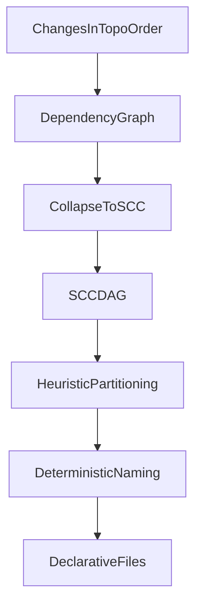

# Graph-Based Declarative Split Plan

## Outcome

Implement a third export mode (working name: `balanced`) that groups changes into dependency-cohesive files using graph partitioning, so output is neither “too many files” (`detailed`) nor one huge `tables_and_functions.sql` (`simple`). Also improve table readability by surfacing foreign-key relationships directly in emitted DDL.

## Existing Hooks To Leverage

- Mode selection is centralized in `[/Users/avallete/.cursor/worktrees/pg-delta-declarative-schema/emp/src/core/export/index.ts](/Users/avallete/.cursor/worktrees/pg-delta-declarative-schema/emp/src/core/export/index.ts)` (`mode` currently chooses `getSimpleFilePath` vs `getFilePath`).
- Grouping/order pipeline already exists in `[/Users/avallete/.cursor/worktrees/pg-delta-declarative-schema/emp/src/core/export/grouper.ts](/Users/avallete/.cursor/worktrees/pg-delta-declarative-schema/emp/src/core/export/grouper.ts)`.
- Type surface for new mode lives in `[/Users/avallete/.cursor/worktrees/pg-delta-declarative-schema/emp/src/core/export/types.ts](/Users/avallete/.cursor/worktrees/pg-delta-declarative-schema/emp/src/core/export/types.ts)`.
- Current “problem file” behavior is in `[/Users/avallete/.cursor/worktrees/pg-delta-declarative-schema/emp/src/core/export/simple-file-mapper.ts](/Users/avallete/.cursor/worktrees/pg-delta-declarative-schema/emp/src/core/export/simple-file-mapper.ts)` where many object types are forced into `tables_and_functions.sql`.

## Algorithm Design (Balanced + No Hard Boundaries)

1. Build a dependency graph on `declarativeChanges` in topological order.
  - Node: a change (index in `declarativeChanges`).
  - Edge: dependency inferred from object identity references and existing topo adjacency.
2. Collapse strongly connected components (SCCs).
  - Treat each SCC as atomic (cannot split safely).
3. Build condensed DAG of SCCs and perform streaming partitioning.
  - Grow a file-bucket while cohesion score stays high and target size budget not exceeded.
  - Start a new bucket when adding a component harms cohesion or exceeds budget.
4. Use heuristics for balanced grouping:
  - Prefer keeping high edge-density neighbors together.
  - Soft penalties for mixing unrelated categories.
  - Soft penalties for very large files and very tiny files.
  - Deterministic tie-breakers: topo index, category priority, object name.
5. Assign file names from dominant semantic signals in each bucket.
  - Pattern: `groups/<dominant_schema_or_cluster>/<dominant_category_or_mixed>/<bucket_label>.sql`.
  - Keep deterministic stable names (hash suffix from stable object ids if needed).

## Concrete Code Changes

- Extend export types/options:
  - Update `[/Users/avallete/.cursor/worktrees/pg-delta-declarative-schema/emp/src/core/export/types.ts](/Users/avallete/.cursor/worktrees/pg-delta-declarative-schema/emp/src/core/export/types.ts)` to add mode `balanced` and graph-split config (targets like `maxStatementsPerFile`, `cohesionWeight`, `mixPenalty`, `minStatementsPerFile`).
- Add graph splitter module:
  - New file `[/Users/avallete/.cursor/worktrees/pg-delta-declarative-schema/emp/src/core/export/graph-splitter.ts](/Users/avallete/.cursor/worktrees/pg-delta-declarative-schema/emp/src/core/export/graph-splitter.ts)` with:
    - graph builder from sorted changes,
    - SCC computation,
    - condensed DAG partitioner,
    - deterministic file-path generator.
- Integrate new mode in export pipeline:
  - Update `[/Users/avallete/.cursor/worktrees/pg-delta-declarative-schema/emp/src/core/export/index.ts](/Users/avallete/.cursor/worktrees/pg-delta-declarative-schema/emp/src/core/export/index.ts)` to route `mode: "balanced"` through graph splitter output (bypassing only-path mapper when needed).
- Keep grouper reusable for legacy modes:
  - Minimal updates in `[/Users/avallete/.cursor/worktrees/pg-delta-declarative-schema/emp/src/core/export/grouper.ts](/Users/avallete/.cursor/worktrees/pg-delta-declarative-schema/emp/src/core/export/grouper.ts)` only if shared ordering helpers are extracted.
- Expose usage in script/docs:
  - Update `[/Users/avallete/.cursor/worktrees/pg-delta-declarative-schema/emp/scripts/declarative-export.ts](/Users/avallete/.cursor/worktrees/pg-delta-declarative-schema/emp/scripts/declarative-export.ts)` to accept/use `mode: "balanced"` and optional tuning params.
  - Update docs in `[/Users/avallete/.cursor/worktrees/pg-delta-declarative-schema/emp/README.md](/Users/avallete/.cursor/worktrees/pg-delta-declarative-schema/emp/README.md)` (and export overview doc if desired) with examples and tradeoffs.

## FK Relationship Visibility (Comments + Optional Inline)

1. Add export options for FK rendering strategy:
  - `foreignKeyRendering: "separate" | "comment" | "inline-safe"` (default: `comment`).
2. Build FK metadata map from table-constraint changes:
  - source table/columns, target table/columns, constraint name, actions.
3. Comment mode:
  - Augment `CREATE TABLE` SQL with concise comments near each FK column or table constraint, e.g. `-- FK: order_items.order_id -> orders.id`.
  - Keep FK DDL physically separate (current dependency behavior unchanged).
4. Inline-safe mode:
  - Inline FK constraints into `CREATE TABLE` only when referenced table is guaranteed available before the table creation point.
  - If not safe, emit as separate deferred FK statement (fallback to current behavior).
5. Preserve determinism:
  - Stable ordering for comments and inline constraints by constraint name/topo index.

## Heuristic Defaults (Initial)

- `targetStatementsPerFile`: 120
- `maxStatementsPerFile`: 220
- `minStatementsPerFile`: 40
- `cohesionWeight`: 1.0
- `categoryMixPenalty`: 0.25
- `schemaMixPenalty`: 0.15 (soft only, since you chose no hard boundaries)
- fallback safety: if partition quality is poor, degrade toward category grouping to avoid pathological splits.

## Validation

- Add targeted tests for:
  - circular dependency cluster remains unsplit,
  - giant simple-style workload splits into multiple balanced files,
  - deterministic output (same input => same paths/order),
  - apply-order correctness using generated `order.json`,
  - FK comment mode emits readable relationship hints without changing execution semantics,
  - inline-safe mode inlines only dependency-safe FKs and correctly falls back for unsafe/cyclic cases.
- Run existing declarative export tests plus script smoke path to ensure backward compatibility for `simple` and `detailed`.

## Canary Gate (Dogfooding Script)

- Make the dogfooding script accept the new mode and run it as a required canary:
  - `MODE=balanced ./scripts/declarative-schema-supabase-dogfooding.sh`
- Required success conditions:
  - export completes and writes files,
  - all files apply successfully in generated order,
  - roundtrip verification passes with `0 changes`.
- Add output sanity checks (non-blocking warning or blocking, per implementation choice):
  - file count should be strictly between current `simple` and `detailed` in the Supabase dogfooding dataset (today: `simple=12`, `detailed=856`),
  - largest file statement count is lower than `simple` mode’s largest file baseline.
- Capture canary metrics in script output for easy regression tracking:
  - total changes,
  - total files,
  - max statements per file,
  - roundtrip diff count.

## Acceptance Criteria

- Output file count is significantly lower than `detailed` on large schemas.
- Largest file is significantly smaller than current `tables_and_functions.sql` in `simple` mode.
- Re-applying files in exported order succeeds without dependency failures.
- Running export twice on same input yields identical file paths/content ordering.
- Table DDL clearly communicates FK relationships (at least via comments by default).
- Inline FK mode never introduces ordering regressions; unsafe relationships remain deferred.
- Dogfooding canary with `MODE=balanced` passes export, apply, and roundtrip (`0 changes`).

