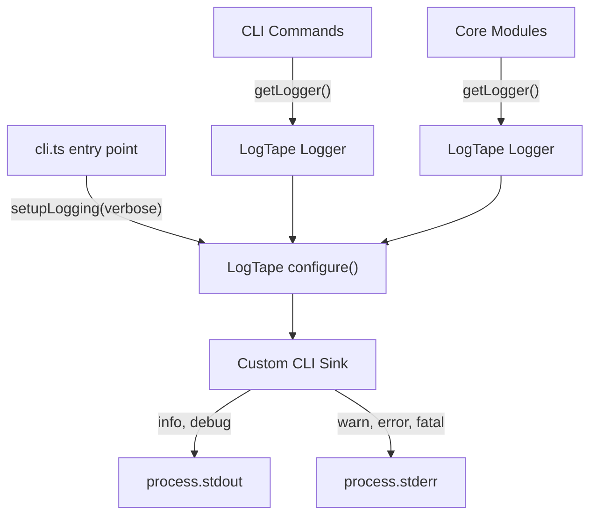

# Adopt LogTape for Structured CLI Logging

## Problem

All CLI commands write directly to `this.process.stdout.write()` / `this.process.stderr.write()` with inline chalk formatting scattered throughout command logic. There is no logging abstraction, no consistent level-based routing, and the declarative commands especially mix display logic with business logic (30+ raw write calls in `declarative-apply.ts` alone).

The existing plan/apply/sync commands partially mitigate this with utility functions (`handleApplyResult`, `formatPlanForDisplay`), but the declarative commands don't follow that pattern.

## Design

### Architecture

**Key decisions:**

- **Custom CLI sink** that routes info/debug to stdout and warn/error/fatal to stderr
- Chalk formatting stays at the call site (not in the sink) -- the sink is a thin router
- **Pre-parse `--verbose`/`-v**` from argv in `cli.ts` before Stricli runs, so LogTape is configured once at startup
- **Category hierarchy**: `["pg-delta", "cli", "<command>"]` for commands, `["pg-delta", "core", "<module>"]` for core modules
- LogTape's library-first design means core modules just call `getLogger()` without configuration; the CLI entry point configures sinks
- `debug` level = verbose-only output, `info` level = always-shown output

### Log Level Mapping

- `info` -> stdout: Normal user-facing output (summaries, trees, progress, tips with chalk)
- `debug` -> stdout: Verbose-only output (round details, diagnostics) -- only shown with `--verbose`
- `warn` -> stderr: Warnings (file conflicts, validation warnings)
- `error` -> stderr: Hard failures (stuck, errors)
- `trace` -> stdout: Internal debug (replaces `debug` package, enabled via `DEBUG` env var or log level config)

## Changes

### 1. Install `@logtape/logtape`, remove `debug`

In [package.json](package.json):

- Add `@logtape/logtape` to dependencies
- Remove `debug` and `@types/debug` from dependencies/devDependencies
- Keep `chalk` (still used for message-level formatting)

### 2. Create logging module: `src/cli/logging.ts`

New file with:

- `createCliSink()` -- a custom LogTape `Sink` that renders message parts to a string and writes to `process.stdout` (info/debug/trace) or `process.stderr` (warn/error/fatal), with no newline auto-appending (let callers control formatting)
- `setupLogging(options: { verbose?: boolean })` -- calls `configure()` with the CLI sink and sets `lowestLevel` based on verbose flag
- Also checks `process.env.DEBUG` containing `pg-delta` to enable trace level (backward compat with existing `DEBUG=pg-delta:*` usage)

### 3. Update entry point: [src/cli/bin/cli.ts](src/cli/bin/cli.ts)

- Import `setupLogging` and call it before `run()`, pre-parsing `--verbose`/`-v` from `process.argv`
- Add `dispose()` import for clean shutdown

### 4. Refactor declarative-apply: [src/cli/commands/declarative-apply.ts](src/cli/commands/declarative-apply.ts)

Replace all `this.process.stdout.write()` and `this.process.stderr.write()` with logger calls:

- `getLogger(["pg-delta", "cli", "declarative-apply"])`
- Progress messages -> `logger.info`
- Verbose round details -> `logger.debug`
- Diagnostics/warnings -> `logger.warn`
- Errors -> `logger.error`

Extract result handling into a utility function `formatDeclarativeApplyResult()` in [src/cli/utils/apply-display.ts](src/cli/utils/apply-display.ts) (new file, analogous to `handleApplyResult` in `utils.ts`).

### 5. Refactor declarative-export: [src/cli/commands/declarative-export.ts](src/cli/commands/declarative-export.ts)

Same pattern -- replace raw writes with logger calls. The file tree and summary formatting from [src/cli/utils/export-display.ts](src/cli/utils/export-display.ts) already return strings, so those just get passed to `logger.info()`.

### 6. Refactor existing commands

- [src/cli/commands/plan.ts](src/cli/commands/plan.ts): Replace `this.process.stdout.write()` with logger
- [src/cli/commands/apply.ts](src/cli/commands/apply.ts): Replace `this.process.stderr.write()` with logger
- [src/cli/commands/sync.ts](src/cli/commands/sync.ts): Replace `this.process.stdout.write()` with logger
- [src/cli/utils.ts](src/cli/utils.ts): Refactor `handleApplyResult()` and `validatePlanRisk()` to use a logger instead of taking `CommandContext` for output (keep context only for `promptConfirmation` which needs stdin)

### 7. Replace `debug` in core modules

Replace `import debug from "debug"` with `import { getLogger } from "@logtape/logtape"`:

- [src/core/sort/sort-changes.ts](src/core/sort/sort-changes.ts): `debug("pg-delta:graph")` -> `getLogger(["pg-delta", "core", "graph"])`
- [src/core/sort/debug-visualization.ts](src/core/sort/debug-visualization.ts): same
- [src/core/catalog.diff.ts](src/core/catalog.diff.ts): `debug("pg-delta:catalog")` -> `getLogger(["pg-delta", "core", "catalog"])`

These use `debug` level (or `trace` for very verbose graph output). The conditional `if (debugGraph.enabled)` pattern maps to `if (logger.isEnabledFor("debug"))`.

### 8. Clean up export-display: [src/cli/utils/export-display.ts](src/cli/utils/export-display.ts)

No major changes needed -- functions already return formatted strings. Minor: ensure `formatExportSummary` doesn't need to know about output streams.

## Files Changed (summary)

| File                                     | Action                                                  |
| ---------------------------------------- | ------------------------------------------------------- |
| `package.json`                           | Add `@logtape/logtape`, remove `debug` + `@types/debug` |
| `src/cli/logging.ts`                     | **New** - LogTape config + CLI sink                     |
| `src/cli/bin/cli.ts`                     | Setup logging before app run                            |
| `src/cli/utils/apply-display.ts`         | **New** - declarative apply display utilities           |
| `src/cli/commands/declarative-apply.ts`  | Refactor to use logger                                  |
| `src/cli/commands/declarative-export.ts` | Refactor to use logger                                  |
| `src/cli/commands/plan.ts`               | Refactor to use logger                                  |
| `src/cli/commands/apply.ts`              | Refactor to use logger                                  |
| `src/cli/commands/sync.ts`               | Refactor to use logger                                  |
| `src/cli/utils.ts`                       | Refactor utilities to use logger                        |
| `src/core/sort/sort-changes.ts`          | `debug` -> LogTape                                      |
| `src/core/sort/debug-visualization.ts`   | `debug` -> LogTape                                      |
| `src/core/catalog.diff.ts`               | `debug` -> LogTape                                      |
| `src/cli/utils/export-display.ts`        | Minor cleanup                                           |

