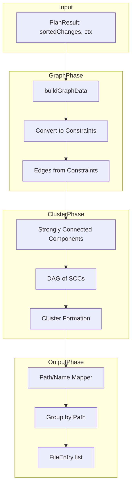

# Smart Declarative Schema Clustering

## Problem Summary

- **Detailed mode**: One file per object → hundreds of files (e.g., `schemas/public/tables/users.sql`, `schemas/public/functions/get_user.sql`)
- **Simple mode**: One file per category → `tables_and_functions.sql` becomes massive (~9900 lines) because tables, views, functions, matviews share circular dependencies

The goal is a **programmatic middle ground**: find clusters of tightly coupled changes that can be isolated into one file, using the existing dependency graph and heuristics for naming.

## Architecture Overview




## Implementation Plan

### 1. Reuse Existing Graph Infrastructure

The sort module already provides everything needed:

- [src/core/sort/graph-builder.ts](src/core/sort/graph-builder.ts): `buildGraphData`, `convertCatalogDependenciesToConstraints`, `convertExplicitRequirementsToConstraints`, `convertConstraintsToEdges`
- [src/core/sort/types.ts](src/core/sort/types.ts): `GraphData`, `Constraint`, `Edge`, `PgDependRow`

**Key**: Export needs to rebuild the graph for **declarative changes only** (create/alter, no drops). Use `ctx.branchCatalog.depends` for catalog dependencies, same as the CREATE phase in `sortPhaseChanges`.

### 2. Add SCC Detection

Implement Tarjan's or Kosaraju's algorithm for **Strongly Connected Components** in a new module:

- **File**: `src/core/export/cluster/scc.ts`
- **Input**: `edges: Array<[number, number]>` (change index pairs)
- **Output**: `Map<number, number>` (change index → SCC id) or `number[][]` (list of SCCs as change index arrays)

Changes in the same SCC have circular dependencies and **must** be in the same file.

### 3. Build SCC Condensation DAG

- **File**: `src/core/export/cluster/condensation.ts`
- **Input**: SCCs, original edges
- **Output**: DAG of SCCs with edges (SCC A → SCC B iff some change in A depends on some change in B)
- **Purpose**: Ensures cluster merging respects dependency order; we can only merge SCCs that are "adjacent" in the DAG without creating ordering conflicts

### 4. Cluster Formation Algorithm

**File**: `src/core/export/cluster/clusterer.ts`

**Inputs**:

- SCCs (each SCC = minimal merge unit)
- SCC DAG
- `changes: Change[]`
- Config: `maxStatementsPerFile`, `preferCategorySplit`, `preferSchemaSplit`

**Algorithm** (heuristic-based):

1. **Initial clusters** = SCCs (each SCC is one cluster)
2. **Merge phase**: Greedily merge adjacent clusters (in the DAG) when:
  - Merge would not exceed `maxStatementsPerFile`
  - Optional: Same dominant category (tables, functions, etc.) or same schema
  - Optional: Merge small clusters (< `minClusterSize`) into neighbors
3. **Category heuristic**: When merging, prefer clusters that share the same `FileCategory` (from [types.ts](src/core/export/types.ts) `CATEGORY_PRIORITY`)
4. **Schema heuristic**: Prefer merging clusters from the same schema when possible

**Alternative simpler approach**: Level-based grouping—group SCCs at the same topological level in the DAG. This naturally creates "layers" (e.g., all types, then all tables that depend only on types, etc.).

### 5. Path/Name Mapper for Smart Mode

**File**: `src/core/export/smart-file-mapper.ts`

Given a cluster (set of change indices) and the changes:

- **Folder structure**: 
  - If all changes in one schema: `schemas/{schema}/`
  - If mixed schemas: flat `cluster/` or per-schema subfolders
- **Filename**: 
  - Dominant category + optional qualifier: `tables_users_orders.sql`, `functions_auth.sql`
  - Or numeric: `000001_tables.sql` (when orderPrefix is used)
- **Heuristics**:
  - Single-category cluster → `{category}.sql` or `{category}_{suffix}.sql`
  - Mixed category → `mixed_{primary_schema}.sql` or `cluster_{id}.sql`

### 6. Integration with Export

**File**: [src/core/export/index.ts](src/core/export/index.ts)

- Add `mode: "smart"` to `ExportMode`
- Add `ExportOptions.clusterOptions?: { maxStatementsPerFile?: number; minClusterSize?: number; ... }`
- When `mode === "smart"`:
  1. Build graph from declarative changes using `buildGraphData` + constraints (reuse sort logic; need to extract/export the constraint-building for create phase)
  2. Run SCC detection
  3. Build condensation DAG
  4. Run clusterer
  5. Use smart mapper to assign path per cluster
  6. Group changes by cluster path, sort by topological order of clusters

**Constraint**: The sort module's graph building is currently tied to `sortPhaseChanges`. We need to either:

- **Option A**: Extract a `buildDependencyEdges(phaseChanges, dependencyRows, graphData)` helper in the sort module and call it from export
- **Option B**: Duplicate the constraint-building logic in export (undesirable)

**Recommendation**: Extract `buildEdgesForPhase` (or similar) in `graph-builder.ts` that takes changes + catalog depends and returns `Edge[]`. The sort module already uses these pieces; we just need a single entry point for export.

### 7. File Ordering

Clusters form a DAG. Output files in topological order of clusters (cluster A before B if any change in A must run before any change in B). Use `performStableTopologicalSort` on cluster indices.

## Files to Create/Modify


| Action | File                                                                             |
| ------ | -------------------------------------------------------------------------------- |
| Create | `src/core/export/cluster/scc.ts` — Tarjan's SCC                                  |
| Create | `src/core/export/cluster/condensation.ts` — SCC DAG                              |
| Create | `src/core/export/cluster/clusterer.ts` — Merge heuristic                         |
| Create | `src/core/export/smart-file-mapper.ts` — Path from cluster                       |
| Modify | `src/core/sort/graph-builder.ts` — Export `buildEdgesForDeclarativePhase` helper |
| Modify | `src/core/export/types.ts` — Add `"smart"` mode, `ClusterOptions`                |
| Modify | `src/core/export/index.ts` — Wire smart mode                                     |
| Modify | `src/core/export/grouper.ts` — Support cluster-based grouping                    |


## Configuration Options (Suggested)

```typescript
interface ClusterOptions {
  maxStatementsPerFile?: number;   // e.g. 500; cap file size
  minClusterSize?: number;          // e.g. 5; merge tiny clusters
  preferCategorySplit?: boolean;    // avoid mixing tables/functions when possible
  preferSchemaSplit?: boolean;      // avoid mixing schemas when possible
}
```

## Edge Cases

1. **Single giant SCC**: If tables+functions form one big cycle (common in simple mode), the smart mode will keep them in one file—same as simple. The value comes when there are smaller cycles or clear boundaries.
2. **No dependencies**: Changes with no edges (e.g., independent extensions) become single-node SCCs; clusterer can merge by category.
3. **Large independent clusters**: Respect `maxStatementsPerFile` by not merging beyond that size.

## Testing Strategy

- Unit tests for SCC on synthetic graphs (cycle, diamond, disjoint)
- Unit tests for clusterer: verify merge respects DAG, respects size limits
- Integration test: run `declarative-export` with `mode: "smart"` and compare file count vs simple/detailed

## Canary Test: Dogfooding Script

**Primary validation** that smart mode works end-to-end: use the existing [declarative-schema-supabase-dogfooding.sh](scripts/declarative-schema-supabase-dogfooding.sh) with `MODE=smart`.

**Flow** (same as simple/detailed):

1. Export declarative schema from source (db-empty) vs target (db) → `declarative-schemas/` with `order.json`
2. Start platform-db container, create empty database
3. Apply SQL files in `order.json` order (single pass, `-v ON_ERROR_STOP=1`)
4. Verify roundtrip: `pgdelta plan --source $DB_URL --target $TARGET_URL` → expect "No changes detected." (0 diff)

**Success criteria**:

- `MODE=smart ./scripts/declarative-schema-supabase-dogfooding.sh` completes without error
- `Wrote 1934 changes to N files` (N between 12 and 856; smart mode should land in that range)
- `All files applied successfully.`
- `Verification passed: 0 changes (declarative schema roundtrip OK).`

**Prerequisite**: [declarative-export.ts](scripts/declarative-export.ts) must support `MODE` env var (e.g. `MODE=simple|detailed|smart`) and pass it to `exportDeclarativeSchema` as `mode`. If not already present, add:

```ts
const mode = (process.env.MODE ?? "simple") as ExportMode;
const output = exportDeclarativeSchema(planResult, { mode, ... });
```

---

# FK Comments and Inlining on CREATE TABLE

## Goal

Improve CREATE TABLE readability by either:

1. **Comments**: Add `-- FK -> schema.table(column)` on columns that are foreign keys
2. **Inlining** (optional): Include REFERENCES directly in CREATE TABLE when possible, avoiding separate ALTER TABLE ADD CONSTRAINT statements

## Current State

- Table model has `constraints` including FK constraints (`constraint_type: "f"`) with `key_columns`, `foreign_key_columns`, `foreign_key_schema`, `foreign_key_table`, `definition`
- [CreateTable](src/core/objects/table/changes/table.create.ts) serializes only columns—no constraints
- FK constraints are emitted as separate [AlterTableAddConstraint](src/core/objects/table/changes/table.alter.ts) changes (e.g., `ALTER TABLE t ADD CONSTRAINT fk_x FOREIGN KEY (col) REFERENCES other(id)`)
- `constraint.definition` already contains the full `FOREIGN KEY (...) REFERENCES ...` clause (from `pg_get_constraintdef`)

## Implementation: Comments (Low Risk)

**File**: [src/core/objects/table/changes/table.create.ts](src/core/objects/table/changes/table.create.ts)

1. Build a map `columnName -> FK constraint` from `table.constraints` where `constraint_type === "f"`
  - For each FK: `key_columns` are the local columns; a column may appear in multiple FKs (use first or concatenate)
2. When building `columnDefinitions`, for each column check if it has an FK
3. Append `-- FK -> {schema}.{table}({ref_col})` to the column tokens (using `foreign_key_effective_schema`, `foreign_key_effective_table`, `foreign_key_columns`)

**Example output**:

```sql
CREATE TABLE public.orders (
  id uuid PRIMARY KEY,
  user_id uuid NOT NULL,  -- FK -> public.users(id)
  ...
);
```

**Composite FK**: For multi-column FKs, add comment to the first column in `key_columns`: `-- FK (col1, col2) -> schema.table(ref1, ref2)`

## Implementation: Inlining (Higher Risk, Optional)

**Sort order**: Inlining is safe. CreateTable with inline REFERENCES would require the referenced table to exist first. We must add FK-referenced tables to `CreateTable.requires`. The topological sort already orders by `requires`, so referenced tables will be created first.

**Approach**:

1. **Modify CreateTable.serialize** to include FK constraints in the CREATE TABLE body:
  - Single-column FK: Add `REFERENCES schema.table(col)` inline on the column (after NOT NULL, before any trailing comma)
  - Multi-column FK: Add table-level constraint: `, CONSTRAINT name FOREIGN KEY (a, b) REFERENCES other(c, d)`
  - Use `constraint.definition` for the clause (it already has the full syntax from pg_get_constraintdef)
2. **Modify CreateTable.requires** to include referenced table/columns for FK constraints in `table.constraints`
3. **Modify table.diff** ([table.diff.ts](src/core/objects/table/table.diff.ts)): When emitting changes for a NEW table, do NOT emit `AlterTableAddConstraint` for FK constraints—they are included in CreateTable. For ALTERED tables (constraint added to existing table), keep emitting AddConstraint.

**Edge cases**:

- Partition tables: Skip `is_partition_clone` constraints (same as today)
- NOT VALID constraints: Include in CREATE but may need separate VALIDATE—check if CREATE TABLE supports NOT VALID (it does: `REFERENCES ... NOT VALID`)

## Export Option

Add to `ExportOptions` (or a serialization option):

```typescript
fkAnnotations?: "none" | "comment" | "inline";
// - "none": current behavior
// - "comment": add -- FK -> ... on columns
// - "inline": include REFERENCES in CREATE TABLE, suppress AddConstraint
```

This would require passing the option through to the serialization layer. The simplest approach: make it a **CreateTable-level option** or an **Integration serialize override**. Alternatively, add it to the Integration DSL so users can opt in per-plan.

## Files to Modify


| Action | File                             | Change                                                                          |
| ------ | -------------------------------- | ------------------------------------------------------------------------------- |
| Modify | `table.create.ts`                | Add FK comment logic; optionally add FK constraints to CREATE body and requires |
| Modify | `table.diff.ts`                  | When creating new table, skip AddConstraint for FK constraints (if inlining)    |
| Modify | `export/types.ts` or integration | Add `fkAnnotations` option (if configurable)                                    |


## Recommendation

Implement **comments** first—low risk, high value. Add **inlining** as a follow-up with proper testing for sort order and partition/edge cases.