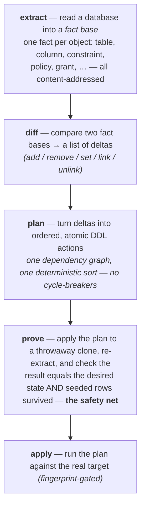

# Getting started with pgdelta

`pgdelta` turns one PostgreSQL schema into another. You give it a **source**
(where you are) and a **desired** state (where you want to be); it produces an
ordered DDL migration, **proves** that migration converges with your data intact,
and applies it.

You can drive it two ways:

- **The CLI** — `pgdelta <command>` for diffing, planning, proving, applying,
  and a declarative `.sql`-files workflow.
- **The library** — import the pipeline functions (`extract`, `plan`, `apply`,
  `provePlan`, …) and compose them yourself.

> **Status:** `@supabase/pg-delta` is this clean-room engine, published as a
> **breaking-change alpha** (`1.0.0-alpha.x`). It replaced the legacy engine
> outright — the CLI, the public API, and the persisted artifact formats are
> all new; nothing carries over. See [overview.md](overview.md) for the why.

---

## The mental model

Everything flows through one pipeline:



The desired state can come from **another live database** or from your
**`.sql` files** (loaded into a scratch "shadow" database first — PostgreSQL,
not a SQL parser, elaborates them). Either way the same pipeline runs.

---

## CLI

### Install / run

From the monorepo (Bun):

```bash
bun install
cd packages/pg-delta
bun run src/cli/main.ts <command> [flags]
# or, if linked on your PATH:
pgdelta <command> [flags]
```

`pgdelta help` prints the command list. Exit codes: **0** success,
**1** runtime failure (or drift detected), **2** bad arguments, **3** blocking
diagnostics (e.g. the `--strict-coverage` refusal, or `render` on a plan with
no actions).

### Flow 1 — migrate one database to match another

```bash
# 1. See what would change (human-readable)
pgdelta diff --source "$SOURCE_URL" --desired "$DESIRED_URL"

# 2. Produce a plan artifact (JSON)
pgdelta plan --source "$SOURCE_URL" --desired "$DESIRED_URL" --out plan.json

# 3. (recommended) Prove it on a sacrificial clone of the source
pgdelta snapshot --source "$DESIRED_URL" --out desired.snapshot
pgdelta prove --plan plan.json --clone "$CLONE_URL" --desired-snapshot desired.snapshot

# 4. Apply to the real target (fingerprint-gated against the source it was planned from)
pgdelta apply --plan plan.json --target "$SOURCE_URL"
```

`prove` accepts localhost, loopback addresses, and Unix sockets by default. For
a local container DNS name, add its exact host with
`--trusted-local-host postgres.orb.local`. Any port on that exact host is
accepted, which accommodates dynamically allocated container ports. An
intentional remote clone requires `--allow-remote-clone`. The command refuses
the plan's original source endpoint and observed PostgreSQL database identity,
and verifies both the clone fingerprint and desired snapshot before auto-seeding
or applying any DDL. Cluster-scoped plans also require a clone from a different
PostgreSQL lineage. Physical/base-backup clones retain the source lineage and
database identity and are therefore unsupported; use a logical/reinitialized
clone. Legacy and direct-library plans carry no identity stamp, so CLI proof of
those artifacts fails closed unless `--allow-unverified-source-identity` is
supplied. The same explicit override is available when the clone role cannot
execute `pg_catalog.pg_control_system()`. That flag cannot override a confirmed
identity match.

Clone URLs must remain pinned to one database and one physical PostgreSQL
lineage for the entire command. Multi-cluster transaction/load-balancing
endpoints that can switch backends are unsupported.

Plans containing actions marked `dataLoss:"destructive"` require the separate
`--allow-data-loss` flag at `apply` time. `--force` only bypasses the source
fingerprint check; it never authorizes data loss.

`plan` writes the JSON plan to stdout (or `--out <file>`) and a summary
(action count, filtered deltas, safety report, rename candidates) to stderr.

`prove` always prints the plan's projection-audit result. Current plans show a
summary of raw source/desired differences hidden by policy, baseline,
capability, management-scope, `managedBy`, or reference-only projection, with a stable reason
code and classification for each suppression; legacy plans report the audit as
unavailable and ask you to re-plan. Human detail is bounded to 50 entries and 10
suppressions per selected entry by default. When more entries exist, selection
is deterministic: reserve one baseline and one non-baseline acknowledged entry
when present, then fill the remaining slots with suspicious, baseline, and other
acknowledged entries in that order, preserving artifact order within each
bucket. The truncation notice identifies the bounded, safely rendered supplied
plan path and its `projectionAudit`;
pass `--audit-all` to print every entry and suppression. Individual human fields
remain visibly bounded; the artifact retains the complete raw audit.

The audit is informational by default. Add `--strict-audit` to make suspicious
suppressions fail the proof; it evaluates the full audit even when human detail
is truncated. Acknowledged-only entries do not block. Baseline and `managedBy`
causes do not block by themselves, but any suspicious cause makes a mixed-cause
entry suspicious. Strict mode fails closed with an `unavailable` reason for a
legacy plan that predates projection audits; re-plan before relying on that gate.

### Flow 2 — declarative: keep your schema as `.sql` files

Author your schema as ordinary `.sql` files in a directory; order doesn't matter
(the loader resolves dependencies across files in bounded rounds; if a load
still sticks it reconnects once and then escalates to kind-based reordering,
warning you exactly which statement to move — `--no-reorder` opts out of the
reordering, though the one-time reconnect still applies). `schema apply` loads
them into a **shadow** database, extracts that as the desired state, and
migrates the target to match:

```bash
pgdelta schema apply \
  --dir ./schema \
  --target "$TARGET_URL"     # the database to migrate
```

Use `--dry-run` to write the portable apply script to stdout without changing
the target, `--verbose` to stream the real apply's segment and statement trace
to stderr, and `--out-plan <plan.json>` to archive the exact plan immediately
after planning. Status, warnings, and diagnostics stay on stderr, so stdout from
`--dry-run` can be redirected verbatim:

```bash
pgdelta schema apply --dir ./schema --target "$TARGET_URL" --dry-run > apply.sql
```

The script must run statement by statement, in order, on one database session.
The runner must stop on the first error and preserve autocommit outside the
script's explicit `BEGIN`/`COMMIT` blocks; do not submit the whole file as one
multi-statement request or wrap it in one global transaction. For `psql`, use
secure libpq connection configuration (environment, service, or passfile
settings) and run:

```bash
psql -X -v ON_ERROR_STOP=1 -f apply.sql
```

Add `--shadow "$SHADOW_URL"` to use an explicit fresh database; otherwise,
database scope creates and later drops a co-located shadow automatically.

Explicit shadows follow the same endpoint policy as proof clones: local by
default, an exact custom hostname via `--trusted-local-host`, or an
intentional remote database via `--allow-remote-shadow`. pg-delta observes both
connections before loading SQL and refuses when shadow and target are the same
database. Cluster scope additionally requires a different PostgreSQL lineage.
If the server denies `pg_catalog.pg_control_system()`, explicit-shadow apply
fails closed with a grant-remediation hint.

Explicit shadow and target URLs must each remain pinned to one database and one
physical PostgreSQL lineage for the entire command. Multi-cluster
transaction/load-balancing endpoints that can switch backends are unsupported.

Export the inverse — a live database back out to `.sql` files:

```bash
pgdelta schema export --source "$SOURCE_URL" --out-dir ./schema
# Writes one directory per schema at the root plus a reserved _cluster/ for
# objects that belong to no schema:
#   ./schema/app/schema.sql
#   ./schema/app/tables/users.sql
#   ./schema/_cluster/publications.sql
# The default --scope database omits cluster-global roles/memberships; add
# --scope cluster to export them too (./schema/_cluster/roles.sql).
#
# --path-style nested reproduces the historical schemas/app/tables/users.sql +
# cluster/roles.sql tree (composes with every --layout).
#
# --layout by-object (default) groups by schema/kind; --layout ordered emits a
# single load order with the load(export(db)) ≡ db guarantee
#
# --layout grouped restores the old engine's "nice" export: files ordered by
# semantic category, statements sorted within a file for readability, plus
# opt-in grouping:
#   --grouping-mode single-file|subdirectory   (default subdirectory)
#   --group-patterns '[{"pattern":"^auth_","name":"auth"}]'   (first match wins)
#   --flat-schemas partman,audit                (one file per category)
#   --no-group-partitions                       (keep partition children separate)
#
# The exported SQL is pretty-printed by default (lowercase keywords, width 180).
# --format-options overrides the knobs; --no-format turns formatting off
# (the two are mutually exclusive):
#   --format-options '{"keywordCase":"upper","maxWidth":180}'
# Formatting is cosmetic — the load(export(db)) ≡ db guarantee still holds. The
# same formatter is available as a library helper at @supabase/pg-delta/sql-format
# (formatSqlStatements).
#
# The export also drops a .pgdelta-export.json manifest (profile, scope,
# redaction mode, owned files, load order); schema apply reads it back so the
# directory round-trips under the same settings and loads in the recorded order.
# A custom profile is recorded by id only — pass the same --profile <path>
# again at apply time (built-in raw/supabase profiles need no flag).
```

> The shadow database must be fresh and empty. When `--shadow` is omitted in
> database scope, pg-delta creates and later drops a co-located scratch database.
> Cluster scope requires an explicit shadow from an isolated PostgreSQL lineage.

### Detect drift from a saved snapshot

```bash
pgdelta snapshot --source "$PROD_URL" --out prod.snapshot   # capture once
pgdelta drift --env "$PROD_URL" --snapshot prod.snapshot    # later: did it change?
```

`drift` exits **0** when the environment still matches the snapshot, **1** when it
has drifted (and prints the deltas) — handy in CI.

### Command reference

| Command | What it does | Key flags |
|---|---|---|
| `diff` | Print the deltas between two live DBs | `--source` `--desired` `[--strict-coverage]` |
| `plan` | Produce a plan artifact (JSON) | `--source` `--desired` `[--out]` `[--profile]` `[--renames]` `[--no-compact]` `[--accept-rename]` `[--restrict-to-applier]` `[--no-restrict-to-applier]` `[--strict-coverage]` |
| `render` | Write a plan out as reviewable `.sql` | `--plan` `--out` `[--allow-drops]` |
| `apply` | Apply a plan to a target | `--plan` `--target` `[--profile]` `[--force]` `[--allow-data-loss]` |
| `prove` | Apply a plan to a clone and verify convergence + data preservation | `--plan` `--clone` `--desired-snapshot` `[--profile]` `[--strict-audit]` `[--audit-all]` `[--trusted-local-host]` `[--allow-remote-clone]` `[--allow-unverified-source-identity]` |
| `snapshot` | Save a database's fact base to a file | `--source` `--out` `[--strict-coverage]` |
| `drift` | Compare a live DB against a saved snapshot | `--env` `--snapshot` `[--strict-coverage]` |
| `schema export` | Export a live DB to `.sql` files | `--source` `--out-dir` `[--scope]` `[--layout]` `[--path-style]` `[--format-options]` `[--no-format]` `[--profile]` `[--strict-coverage]` |
| `schema apply` | Load `.sql` files via a shadow DB and migrate a target | `--dir` `[--shadow]` `--target` `[--scope]` `[--isolated-shadow]` `[--renames]` `[--accept-rename]` `[--force]` `[--allow-data-loss]` `[--no-reorder]` `[--trusted-local-host]` `[--allow-remote-shadow]` `[--profile]` `[--restrict-to-applier]` `[--no-restrict-to-applier]` `[--strict-coverage]` `[--dry-run]` `[--verbose]` `[--out-plan]` |
| `schema lint` | Statically check `.sql` files for load-order problems (no database) | `--dir` `[--custom-migration-refs warn\|off]` |

Common flags, explained:

- **`--profile raw\|supabase\|<path>`** — selects an *integration profile*
  (default `raw`). `supabase` knows about Supabase-managed
  roles/schemas/extensions and excludes them from the diff; a path (containing
  `/` or ending in `.json`) loads a custom profile. See [Profiles](#profiles)
  below.
- **`--strict-coverage`** — refuse to act while user objects exist in a kind the
  engine doesn't model yet (instead of silently ignoring them).
- **`--strict-audit`** — on `prove`, fail when the plan's projection audit has
  suspicious entries. Acknowledged-only entries do not block; baseline and
  `managedBy` causes are non-blocking by themselves, while any suspicious cause
  makes a mixed-cause entry suspicious.
- **`--audit-all`** — on `prove`, print every projection-audit entry and
  suppression instead of the default 50-entry/10-suppression caps. Human fields
  remain bounded; the plan artifact retains the complete raw audit.
- **`--renames auto\|prompt\|off`** — `plan`/`schema apply` default to `prompt`,
  which lists rename candidates you confirm with `--accept-rename <from>=<to>`.
- **`--restrict-to-applier` / `--no-restrict-to-applier`** — managed-view
  commands probe the connection role and drop operations that role cannot
  replay (FDW ACLs, PG16+ CREATEROLE self-ADMIN memberships). That probe is
  the default. `--restrict-to-applier` is an explicit yes; `--no-restrict-to-applier`
  (`plan` / `schema apply`) keeps the unrestricted view for plan-here /
  apply-as-more-privileged. A superuser probe excludes nothing.
- **`--force`** — disables the fingerprint gate on `apply` (see
  [Safety](#safety-features)). Use sparingly.

---

## Programmatic API

The everything-entry is `@supabase/pg-delta`; each stage is also importable on
its own (`/extract`, `/plan`, `/apply`, `/proof`, `/frontends`, `/core`,
`/policy`, `/integrations`, `/sql-order`, `/sql-format`). Bun consumers get the
TypeScript source directly; Node and Deno get the compiled `dist/` JS.

It takes [`pg`](https://node-postgres.com/) `Pool`s as input.

### Flow 1 — DB to DB

```ts
import { Pool } from "pg";
import { extract } from "@supabase/pg-delta/extract";
import { plan } from "@supabase/pg-delta/plan";
import { apply } from "@supabase/pg-delta/apply";

const source = new Pool({ connectionString: SOURCE_URL });
const desired = new Pool({ connectionString: DESIRED_URL });

// 1. extract both sides into fact bases
const { factBase: sourceFb } = await extract(source);
const { factBase: desiredFb } = await extract(desired);

// 2. plan the migration source → desired
const thePlan = plan(sourceFb, desiredFb);
for (const action of thePlan.actions) console.log(action.sql);
console.log(thePlan.safetyReport); // destructive / rewrite / lock summary

// 3. apply to the target (re-extracts and checks the fingerprint first)
const report = await apply(thePlan, source);
if (report.status !== "applied") throw new Error(report.error?.message);
```

### Prove before you trust it

```ts
import { provePlan } from "@supabase/pg-delta/proof";

// clonePool is a throwaway copy of the source; it WILL be mutated
const verdict = await provePlan(thePlan, clonePool, desiredFb, {
  strictAudit: true, // optional; suspicious projection entries make ok false
});
console.error(verdict.projectionAuditStatus); // "available" | "unavailable"
console.error(verdict.projectionAudit); // normalized empty when unavailable
if (!verdict.ok) {
  console.error(verdict.driftDeltas);      // what didn't converge
  console.error(verdict.dataViolations);   // rows that vanished
  console.error(verdict.coverage);         // per-table: how it was checked
}
```

### Flow 2 — declarative `.sql` files

```ts
import { loadSqlFiles, exportSqlFiles } from "@supabase/pg-delta/frontends";

// load .sql files into a fresh shadow DB → desired fact base
const { factBase: desiredFb, rounds, diagnostics } = await loadSqlFiles(
  [{ name: "01_tables.sql", sql: "create table t (id int primary key);" }],
  shadowPool,
);

// ...then plan/prove/apply exactly as in Flow 1.

// the inverse: fact base → .sql files
const files = exportSqlFiles(sourceFb, { layout: "by-object" });
```

### Persisting plans and snapshots

```ts
import { serializePlan, parsePlan } from "@supabase/pg-delta/plan";
import { saveSnapshot, loadSnapshot } from "@supabase/pg-delta/frontends";

const json = serializePlan(thePlan);     // plan ↔ JSON round-trips losslessly
const restored = parsePlan(json);

saveSnapshot(sourceFb, "17", "prod.snapshot");
const { factBase } = loadSnapshot("prod.snapshot");
```

### Key types at a glance

- **`FactBase`** — an immutable, content-addressed set of facts + dependency
  edges. Compared by hash.
- **`Plan`** — `{ actions, deltas, filteredDeltas, safetyReport, source, target,
  renameCandidates, … }`. `Action` carries `sql`, `verb`, `transactionality`,
  `lockClass`, `dataLoss`, `rewriteRisk`, and produces/consumes/destroys edges.
- **`ApplyReport`** — `{ status, appliedActions, actionStatuses, error? }`.
- **`ProofVerdict`** — the compatibility shape. Its additive
  `projectionAudit?` and `projectionAuditStatus?` fields remain optional so
  existing consumer-authored verdict literals continue to compile.
- **`ProducedProofVerdict`** — the result returned by `provePlan`; it requires
  `projectionAudit`, `projectionAuditStatus: "available" | "unavailable"`, and
  the normal proof fields (`ok`, drift/data/rewrite violations, and coverage).
  Pre-audit plans produce status `"unavailable"` plus a normalized empty audit.
  `strictAuditFailure?` distinguishes unavailable legacy audits from suspicious
  entries when strict enforcement is requested.

---

## Profiles

An **integration profile** bundles "what state the engine manages": which objects
to extract, what to filter, the platform baseline to subtract, and what the
applier can actually execute. The same profile is threaded through extract → plan
→ prove → apply, so *what you prove is exactly what you run*.

```ts
import { resolveProfile, supabaseProfile } from "@supabase/pg-delta/integrations";

const ctx = await resolveProfile(targetPool, supabaseProfile);
const { factBase } = await ctx.extract(targetPool);
const thePlan = plan(sourceFb, factBase, ctx.planOptions);
await apply(thePlan, targetPool, ctx.applyOptions);
```

- **`raw`** (default) — no policy: diff everything. (It ships one handler, for
  `vault`: extension presence plus best-effort plan warnings on structural use —
  secret state is never read or captured.)
- **`supabase`** — excludes Supabase-managed roles, schemas, and extensions, and
  captures stateful-extension objects (e.g. pg_partman children) so they aren't
  dropped.

On the CLI this is just `--profile supabase`.

---

## Safety features

- **Proof loop** — `prove` (CLI) / `provePlan` (API) is the keystone: a migration
  is only trusted once it has been applied to a clone, re-extracted, and shown to
  converge with data intact.
- **Fingerprint gate** — `apply` re-extracts the target and refuses to run if it
  no longer matches the source the plan was built from (catches drift between
  plan and apply). `--force` disables it.
- **`--strict-coverage`** — fail loudly rather than silently skip objects in
  kinds the engine doesn't model.
- **Honest filtering** — anything a policy filtered out is reported in
  `plan.filteredDeltas`, never silently dropped.

---

## Where to go next

| You want… | Read |
|---|---|
| Why the engine was rebuilt | [overview.md](overview.md) |
| How it works, conceptually | [architecture/README.md](architecture/README.md) |
| The full design (the north star) | [architecture/target-architecture.md](architecture/target-architecture.md) |
| What it models / deliberately excludes | [../packages/pg-delta/COVERAGE.md](../packages/pg-delta/COVERAGE.md) |
| What's next | [roadmap/backlog.md](roadmap/backlog.md) |
