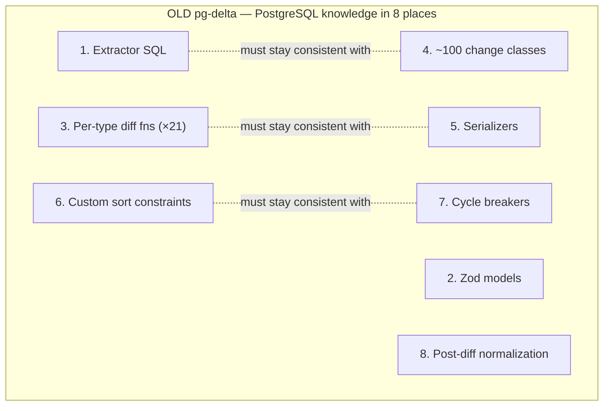
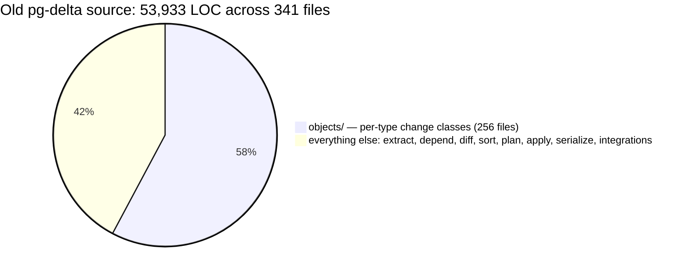
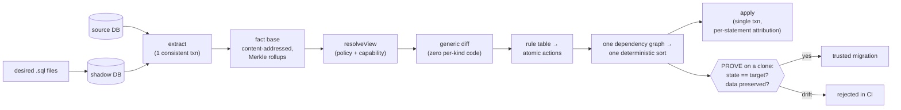
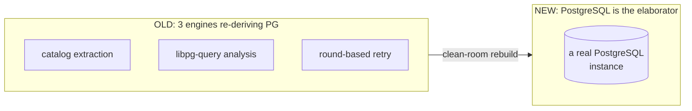

# pg-delta-next: why we rebuilt the schema-diff engine

> **TL;DR** — `@supabase/pg-delta` compares two PostgreSQL databases and emits a
> migration to turn one into the other. The original engine was correct but had
> grown to **~54,000 lines** in which PostgreSQL's semantics were re-implemented
> in **eight** different places, with **no way to prove a migration actually
> works** before shipping it. `pg-delta-next` is a clean-room rebuild on a single
> idea — *let PostgreSQL be the only thing that understands PostgreSQL* — and a
> single safety net: **every migration is applied to a throwaway clone and
> proven to converge, with your data intact, before you trust it.** The result is
> **~11,500 lines (79% smaller)**, one rule table instead of ~100 hand-written
> change classes, a correctness guarantee the old engine never had, and — as of
> the first performance pass — **4.2× faster extraction**.

- **Audience**: engineers, reviewers, and decision-makers evaluating the rewrite.
- **Status**: engine code-complete and proven on a **209-scenario corpus (418
  cases, both directions)** across PostgreSQL 15/17/18 — all green; cutting v1 on
  correctness. See [roadmap/v1.md](roadmap/v1.md).
- **Deep design**: [architecture/target-architecture.md](architecture/target-architecture.md)
  (the north star) and [architecture/managed-view-architecture.md](architecture/managed-view-architecture.md).

---

## 1. The problem with the old engine

A schema-diff tool lives or dies on one question: **does the migration it
generates actually produce the target schema, without destroying data?** The old
`pg-delta` answered this with human review and a large integration suite — never
with a machine check. And the reason it *couldn't* cheaply add one is the deeper
problem: it re-implemented PostgreSQL's own rules, over and over.

### Knowledge was smeared across eight forms

To diff two databases the old engine had to "know" PostgreSQL semantics, and that
knowledge lived in eight different shapes that all had to agree:

Every new object type or edge case meant touching several of these in lockstep.
Worse, three of them are *independent semantic engines* that each re-derive what
PostgreSQL already knows:

| Re-implemented engine | What it did | Failure mode |
|---|---|---|
| Catalog extraction | Read `pg_catalog` into models | Drifts from the real catalog under concurrent DDL |
| libpg-query static analysis (`pg-topo`, WASM) | Parse SQL to infer types/identifiers | Approximate — heuristics disagree with the server |
| Round-based apply | Retry statements until they stick | Worst-case **O(n²)** statement executions |

The single deepest source of bugs in this class of tool is **re-implementing
PostgreSQL semantics**. The old engine did it three times.

### These weren't theoretical — here is what users hit

| Symptom | Structural cause | Status in new engine |
|---|---|---|
| **Data loss**: a schema sync could `DROP` pg_partman partition children and pgmq queue tables | The engine had no notion of "this object is managed by an extension" — it saw rows the desired state lacked and dropped them | **Cannot happen** — `managedBy` provenance edges filter extension-managed objects out of the diff (extension-intent Phase A, shipped) |
| **Inconsistent reads**: `cache lookup failed` aborts mid-run | ~28 extractors ran on a connection pool with *no shared snapshot*, so the catalog and `pg_depend` could disagree under concurrent DDL | **Cannot happen** — extraction is one `REPEATABLE READ` snapshot, consistent by construction |
| **Wrong function signatures** | libpg-query inferred types from SQL text (temp-schema artifacts, normalization gaps) | **Cannot happen** — PostgreSQL reports the canonical signature |
| **Ordering bugs that fought their own fix** | A cycle-breaker registry that grew one entry per field-discovered cycle; post-diff normalization re-injected drops the breaker had removed | **Cannot happen** — at fact grain there are no cycles to break |

### There was no proof loop

The old engine generated a plan and applied it. Nothing re-extracted the result
and checked it equalled the target; nothing seeded rows and checked they
survived. Correctness was discovered in the field, one bug report at a time.

### It had grown enormous

The verified shape of the old codebase today (source only, excluding tests):

**The per-type object layer alone is 31,162 LOC across 256 files — 58% of the
source, 75% of the files** — and roughly two-thirds of it is structurally
identical create/alter/drop/privilege/comment/security-label handling, repeated
once per object type. That single directory is **~2.7× the size of the entire
new engine**.

---

## 2. The core bet: two principles

`pg-delta-next` is built on two inversions (full rationale in
[architecture/target-architecture.md](architecture/target-architecture.md) §2):

**P1 — PostgreSQL is the only elaborator.** Every input state is resolved by an
actual PostgreSQL instance (the live DB, or a shadow DB the engine populates from
your `.sql` files). The engine never parses SQL to *understand* it. There is one
semantic engine, not three. (Static analysis survives only as a dev-time
convenience, never in the trusted path.)

**P2 — PostgreSQL knowledge lives in exactly two forms:** (1) the **extraction
queries** that turn a catalog into facts, and (2) the **rule table** that turns a
fact-level change into DDL. Eight forms collapse to two.

---

## 3. The new architecture in one picture

Everything flows at **one granularity — the fact.** A table, column, constraint,
index, policy, ACL entry, ownership edge, extension membership: each is its own
content-addressed fact. State, diff, dependencies, and actions all live at that
same grain, so:

- **diff is generic** — a rollup-guided descent emitting `add`/`remove`/`set`/
  `link`/`unlink` deltas, with *zero per-type code*;
- **ordering needs no cycle-breakers** — at fact grain, dependency cycles
  structurally cannot form (the trick `pg_dump` uses), so one deterministic
  topological pass replaces the old two-phase sort + `invalidates` side-channel +
  repair loop + three hand-written cycle breakers;
- **the proof loop is cheap** — because re-extraction produces the same facts, a
  migration is *proven* by applying it to a clone, re-extracting, and checking
  the fact hashes match (state proof) and seeded rows survive (data proof).

`resolveView` sits between the fact base and the diff, and is applied
**identically** before `plan()` and before `prove()` — so the plan you prove is
exactly the plan you run.

---

## 4. Old vs new, by the numbers

All figures verified against the working tree (`packages/pg-delta` vs
`packages/pg-delta-next`), source files only (excluding `*.test.ts`).

| Dimension | OLD `pg-delta` | NEW `pg-delta-next` | Change |
|---|---:|---:|---|
| Source LOC (non-test) | 53,933 | 11,471 | **−79%** |
| Source files | 341 | 46 | **−87%** |
| `objects/` per-type code | 256 files / 31,162 LOC | one rule table / 2,183 LOC | **−93% LOC** |
| Semantic engines | 3 (catalog + libpg-query + round-retry) | 1 (PostgreSQL itself) | **−2** |
| Forms of PG knowledge | 8 | 2 | **−6** |
| Per-type diff functions | 21 | 0 (generic diff) | **eliminated** |
| Hand-written change classes | ~100 | 0 (data-driven rules) | **eliminated** |
| Cycle-breaker code | 3 hand-written breakers | 0 (cycles can't form) | **eliminated** |
| Apply model | round-based retry, worst-case O(n²) | ordered single pass | **asymptotically faster** |
| Migration proof | none | state + data-preservation proof on a clone | **new guarantee** |
| Serialize escape-hatch params | many (`skipSchema`, `skipAuthorization`, …) | 1 (`concurrentIndexes`) | **collapsed** |
| libpg-query / WASM in trusted path | yes (hard dependency) | no (dev-time only) | **removed** |
| Extract latency (~12k-object catalog) | ~1.88 s | ~0.45 s | **−76% (4.2×)** |

### Why the test suite shrank too

The old engine carried **~34,000 lines of tests** — largely per-type unit tests
asserting exact SQL strings. The new engine proves correctness *behaviourally*
instead, in **8,444 lines across 52 files**: a **209-scenario corpus, run in both
directions (build and teardown) under the full proof loop, on PostgreSQL 15, 17
and 18** (418 cases per version — all green), plus a **differential harness** and
a **generative soak** (below). Correctness is demonstrated by "apply it and
re-extract — does it match?", not by pinning byte strings.

- **Differential harness** — runs the new and the old engine over the same corpus
  and treats any case where the new engine fails while the old one converges as a
  **hard regression**; every accepted difference carries a documented reason.
- **Generative soak** — property-tests the full proof loop: generate a schema,
  generate a mutation, roundtrip through apply → re-extract → data-preservation
  check, assert fixpoint. Kind-coverage is enforced by a checklist, so coverage
  grows with compute time, not test-authoring effort.

---

## 5. What it does better — and differently

**Correctness is mechanical, not aspirational.** The proof loop is the keystone:
a rule that emits wrong DDL is caught in CI when the clone fails to converge or a
seeded row vanishes — not by a user in production. This *inverts the correctness
economy* of the whole project.

**The managed view is one definition, not three mechanisms.** Scope filtering,
ownership, and "what can this applier actually execute" used to be three
inconsistent code paths (`excludeManaged`, `excludeExtensionMembers`, post-diff
`filterDeltas`) plus serialize escape-hatch params. Concretely: ownership used to
be a `skipAuthorization` boolean threaded through every serializer; now **ownership
is an edge**, and projecting a role out of the view simply prunes that edge — the
parameter ceases to exist *structurally*, not as a workaround. The same move
turned `skipSchema` into the catalog fact `extrelocatable`. All of it collapses
into one `resolveView(facts, policy, capability)` applied identically before
`plan()` and `prove()`. See
[architecture/managed-view-architecture.md](architecture/managed-view-architecture.md).

**Stateful extensions keep their data.** pgmq, pg_cron and pg_partman create
objects (queue tables, partition children, schedule rows) that no `.sql` file
declares. The old engine saw them as "extra" and dropped them. The new engine
attaches a `managedBy` provenance edge at extract time and filters them from the
diff — **no per-extension special-casing in the core**, and the same generic
proof loop verifies the data survives. See
[architecture/extension-intent.md](architecture/extension-intent.md).

**It never silently misses your schema.** If you created an object in a kind the
engine doesn't model (a custom cast, operator class, text-search config, …), the
old engine would simply not see it. The new engine runs a provenance-aware
*catalog completeness check* and reports it as an `unmodeled_kind` diagnostic;
`--strict-coverage` refuses to plan while unmanaged user objects exist. Honest by
construction: it manages X, or it tells you it doesn't.

**Ordering is correct by construction.** No cycle-breaker registry that grows by
one entry per field-discovered cycle — at fact grain there are no cycles to break.

**The core library is lean.** `createPlan` consumers no longer pull a WASM SQL
parser into the trusted path. PostgreSQL does the elaboration.

**It resolves most known issues by design.** Of **134 tracked issues** in the
diffing-2.0 project, roughly **90 are resolved by construction, by the corpus, or
by policy** rather than by porting individual fixes — the architecture dissolves
whole classes of bug. See [archive/linear-assessment.md](archive/linear-assessment.md).
(An independent readiness review flagged five further gaps; all five have since
shipped — see [archive/v1-readiness-review.md](archive/v1-readiness-review.md).)

---

## 6. Performance and memory, measured

Correctness was v1's gate, but the first performance pass has already landed a
large win — and it is a good illustration of the engineering discipline.

**Profile first.** The roadmap *assumed* the big extraction win would be parallel
snapshot extraction. Profiling said otherwise: **one query — the `pg_depend`
dependency resolver — was 86% of extraction time**, because it ran a 160-line
correlated `CASE` subquery twice for every dependency row. Rewriting it
set-based (resolve each catalog once, hash-join to the dependency set) made it
**7× faster**, and extraction **4.2× faster** overall, with byte-identical
output (gated by an edge-set oracle + the full corpus on PG 15/17/18):

| Stage | Before | After | Speedup |
|---|---:|---:|---:|
| `pg_depend` resolver query | 1,434 ms | 204 ms | **7.0×** |
| `extract` (cold, ~12k objects) | 1,881 ms | 453 ms | **4.2×** |
| `extract` (re-extract, warm) | 1,523 ms | 323 ms | 4.7× |

Parallel snapshot extraction was then *re-profiled and deferred*: after the
rewrite the resolver is one unsplittable query that caps the parallel ceiling
below 2×, not worth a consistency-critical refactor.

**Memory.** The content-addressed fact base is lean — measured at **~660 bytes
per fact**; two full catalogs plus the diff and plan for a ~12k-object database
hold only ~15 MB of live objects. Peak resident memory (~200 MB at that scale) is
dominated by the PostgreSQL driver buffering result sets, and is **comparable to
the old engine** (the old engine peaked ~185 MB on the same catalog). Both
materialize catalogs fully, so both scale roughly linearly; a streaming,
*O(changes)* diff is the next memory item on the roadmap
([roadmap/tier-3-extract-memory.md](roadmap/tier-3-extract-memory.md)). A
new `extract()` statement-timeout budget already turns a runaway query on a
pathological schema into an actionable diagnostic instead of a hang.

---

## 7. What is deliberately the same — and out of scope

Honest boundaries matter as much as the wins:

- **Same 7-stage pipeline shape and the `creates/drops/requires` change
  contract** — this was the old engine's genuinely good idea; the rebuild keeps
  it and makes the layers generic.
- **Data diffing (DML) is permanently out of scope** — this is a schema tool.

What v1 does **not** yet do (each documented, regression-free, with a trigger to
revisit):

| Not yet | Why it's safe | Where |
|---|---|---|
| *Model* rare kinds (casts, operators, text-search, statistics, languages, transforms) | They are **detected and reported**, never silently dropped; modeling is demand-driven | [COVERAGE.md](../packages/pg-delta-next/COVERAGE.md), [roadmap/tier-4-deferrals.md](roadmap/tier-4-deferrals.md) |
| Extension-intent **Phase B** (replay extension objects on rebuild) | Phase A (don't-drop) ships; replay is blocked on a declarative-format decision | [roadmap/tier-1-extension-intent-phase-b.md](roadmap/tier-1-extension-intent-phase-b.md) |
| Parallel snapshot extraction | Re-profiled: < 2× win for high refactor risk | [roadmap/tier-3-extract-depends-perf.md](roadmap/tier-3-extract-depends-perf.md) |
| Stage-10 cutover (naming, deprecation, migration guide) | Sequenced after v1 + performance | [roadmap/tier-2-stage-10-cutover.md](roadmap/tier-2-stage-10-cutover.md) |

Consumers migrate once, at the cutover parity bar: the public surface stays the
`createPlan` / `applyPlan` facade, on a new major, with a migration guide.

---

## 8. Where to go next

| You want… | Read |
|---|---|
| The full design rationale (the north star) | [architecture/target-architecture.md](architecture/target-architecture.md) |
| How scope / ownership / capability enter the engine | [architecture/managed-view-architecture.md](architecture/managed-view-architecture.md) |
| How stateful extensions (pgmq, pg_cron, pg_partman) are handled | [architecture/extension-intent.md](architecture/extension-intent.md) |
| The performance work (shipped) and memory roadmap | [roadmap/tier-3-extract-depends-perf.md](roadmap/tier-3-extract-depends-perf.md), [roadmap/tier-3-extract-memory.md](roadmap/tier-3-extract-memory.md) |
| What's left before cutting v1 | [roadmap/v1.md](roadmap/v1.md) and [roadmap/README.md](roadmap/README.md) |
| What the engine models / deliberately excludes | [../packages/pg-delta-next/COVERAGE.md](../packages/pg-delta-next/COVERAGE.md) |
| How it was built, stage by stage | [archive/](archive/) |
