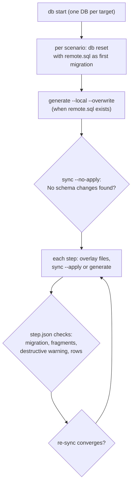

# Declarative-schema scenario tests (Supabase CLI)

- **Status**: In progress (2026-10-06). The suite is built in `supabase/cli`
  (branch `avallete/declarative-scenarios-e2e`, not yet merged).
- **Lives in**: `supabase/cli`,
  `apps/cli/src/commands/db/schema/declarative/scenarios.e2e.test.ts`, with
  fixtures and the format reference in `.../declarative/fixtures/scenarios/README.md`.

## Why

pg-delta's corpus proves plans SQL-state to SQL-state on stock Postgres. The
CLI's declarative workflow adds the grouped export layout, the Supabase profile,
Supabase default privileges, the non-superuser `postgres` role, and its own
shadow and baseline handling. Regressions that only appear in that combination
reach users without any failing test. The #475 regression, fixed in #512, was
one: an unchanged `generate` → `sync` revoked a column grant.

## How it works

- It drives the real `supabase` binary. Shadows, baselines, export layout, and
  formatting are the CLI's own code.
- Each scenario is a folder: `scenario.json`, an optional `remote.sql`, and
  `steps/<nn-name>/` with `step.json` plus optional `schemas/**` overlays.
- Checks are properties, not golden SQL: no-change re-sync, short migration
  fragments, the destructive-warning flag, unchanged files, and row counts.
- `knownIssue` pins an open bug to the step where it fails (optionally a
  single target), and the suite fails once the bug is fixed.
- Targets: Postgres majors (`pg`), plus `orioledb: true` for a PG17 OrioleDB
  database.
- Default per-PR run: the `smoke` scenarios on PG17. Use
  `DECLARATIVE_SCENARIOS=all` for everything, or `DECLARATIVE_SCENARIO=<name>`
  for one scenario.

## Coverage today

- **Workflows:**
  - create from scratch;
  - file-layout changes (move, split, reorder, delete);
  - table and column grants lifecycle;
  - functions and triggers;
  - RLS policies;
  - column changes with data;
  - views on tables;
  - enum values;
  - the `_custom/` escape hatch;
  - the Supabase starter app (`auth.users` trigger, RLS) on PG15 and PG17.
- **Known issues:**
  - #512, column grants under default privileges. Fixed on `main`; the
    marker comes off with the CLI's pg-delta bump.
  - #510, a trigger `WHEN` with a 3+ column row comparison never converges.
  - OrioleDB: the export re-creates the preinstalled `orioledb` extension,
    so the first sync fails with `extension "orioledb" already exists`.
    Likely cause: `orioledb` is missing from `SUPABASE_SYSTEM_EXTENSIONS`.

## Rules

- A declarative-schema bug reported through the CLI gets a pg-delta regression
  test **and** a CLI scenario. See "Declarative schemas (Supabase CLI)" in
  `.github/agents/pg-toolbelt.md`.
- pg-delta changes to export, load, plan files, ACLs, ordering, or the Supabase
  profile run the CLI suite against the PR's `pkg-pr-new` preview before they
  are called done.

## Open items

- A CI job in `supabase/cli` that runs `DECLARATIVE_SCENARIOS=all` nightly and
  on PRs that change the pg-delta version. Today only the smoke set runs per PR.
- `_custom/` SQL is loaded into the shadow only and never migrated to the
  target. Decide whether that is the intended contract.
- Rewriting an exported table file without its GRANT lines revokes the
  platform grants (`anon`, `authenticated`, `service_role`). This may need a DX
  warning.
