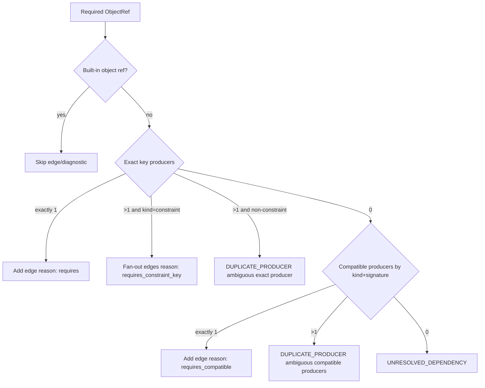
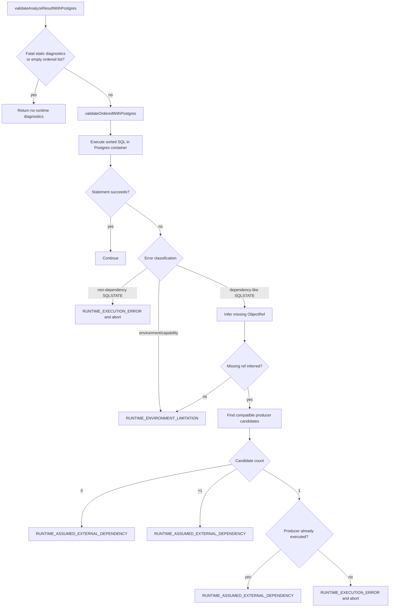

# pg-topo Architecture

This document describes the current implementation of `pg-topo` in `src/` and `test/`.
It is a living architecture reference.

## 1) Purpose

`pg-topo` takes a set of declarative SQL files and produces:

- a deterministic statement execution order
- a dependency graph (`provides`/`requires` edges)
- diagnostics for unresolved dependencies, ambiguities, and cycles

The library is static-only. Runtime execution validation exists only in test support, backed by a real PostgreSQL container via Testcontainers.

## 2) Public API

Package entrypoint:

- `src/index.ts` (re-export target in `package.json` `exports["."]`)

Function exports:

- `analyzeAndSort(sql: string[]): Promise<AnalyzeResult>` — pure library, no filesystem
  - implemented in `src/analyze-and-sort.ts`
- `analyzeAndSortFromFiles(roots: string[]): Promise<AnalyzeResult>` — filesystem adapter
  - implemented in `src/from-files.ts`

Type exports from `src/index.ts`:

- `AnalyzeResult`
- `AnnotationHints`
- `Diagnostic`
- `DiagnosticCode`
- `GraphEdge`
- `GraphEdgeReason`
- `GraphReport`
- `ObjectKind`
- `ObjectRef`
- `PhaseTag`
- `StatementId`
- `StatementNode`

Current primary result shape:

- `AnalyzeResult`
  - `ordered: StatementNode[]`
  - `diagnostics: Diagnostic[]`
  - `graph: GraphReport`

Behavior:

- Static pipeline only (parse, classify, extract, graph, topo-sort, diagnostics)
- Discovery is handled by the filesystem adapter (`src/from-files.ts`), not the core library

## 3) Runtime and parser stack

- SQL and deparse: `plpgsql-parser` (`parseSql`, `deparseSql`)
- PL/pgSQL body parse: `plpgsql-parser` (`parseSync` with `hydrate: true`)
- SQL AST traversal: `@pgsql/traverse`
- Local runtime validation: Testcontainers PostgreSQL (`@testcontainers/postgresql` + `testcontainers`, devDependencies only) with Bun built-in SQL client (`SQL`)

## 4) High-level flow

```mermaid
flowchart TD
  discover[Discover SQL files]
  parse[Parse statements and annotations]
  classify[Classify AST statement class and phase]
  extract[Extract provides/requires object refs]
  graph[Build dependency graph]
  topo[Topo sort with deterministic tie breaks]
  cycle[Detect SCC cycles]
  result[Return ordered statements graph diagnostics]

  discover --> parse --> classify --> extract --> graph --> topo --> cycle --> result
```

## 5) Pipeline details

### 5.1 Discover (`src/ingest/discover.ts`)

- Resolves input roots (files/directories)
- Recursively discovers `.sql` files
- Sorts deterministically
- Emits `DISCOVERY_ERROR` for missing roots

### 5.2 Parse (`src/ingest/parse.ts`)

- Ensures parser module loaded once (`loadModule`)
- Parses file content into parser statements
- Extracts statement SQL using `stmt_location`/`stmt_len`
- Falls back to deparse when sliced SQL is not executable
- Normalizes statement terminators (`;`)
- Parses `pg-topo` annotations per statement
- Emits `PARSE_ERROR` and annotation diagnostics (`INVALID_ANNOTATION`)

### 5.3 Classify (`src/classify/classify-statement.ts`)

- Maps AST roots to `StatementClass`
- Handles variants:
  - function vs procedure
  - view vs materialized view
  - grant vs revoke
  - `DefineStmt` collation/aggregate
- Assigns default `PhaseTag` per statement class

### 5.4 Extract dependencies (`src/extract/extract-dependencies.ts`)

Each statement yields:

- `provides: ObjectRef[]`
- `requires: ObjectRef[]`

Extractor internals are split for readability:

- statement-level orchestration: `src/extract/extract-dependencies.ts`
- shared object/name/AST ref helpers: `src/extract/shared-refs.ts`
- SQL expression and routine-body traversal: `src/extract/expression-dependencies.ts`

Important implemented coverage:

- schema, extension, role, language, fdw/server
- types/domains/collations/sequences
- tables/alter table/indexes/views/materialized views
- functions/procedures/aggregates
- triggers/event triggers/policies
- publications/subscriptions
- grants/revokes/comments/alter owner/default privileges

Notable extraction behavior:

- FK modeling includes referenced relation + synthetic key-level dependency (`constraint` object refs)
- PK/UNIQUE providers are modeled from table constraints, alter-table constraints, and non-partial unique indexes
- expression traversal captures relation/type/function refs
- `nextval('...')` maps to sequence refs
- SQL routine body analysis (qualified refs only) for `LANGUAGE SQL`
- PL/pgSQL body analysis (hydrated AST + SQL traversal) for `LANGUAGE plpgsql`
- function call requirements now include best-effort call signatures:
  - explicit casts -> concrete types
  - boolean/int/float constants -> inferred primitive types
  - unresolved expression types -> `unknown` placeholder

### 5.5 Graph build (`src/graph/build-graph.ts`)

- Builds `producersByKey` from canonical `objectRefKey()`
- Resolves each requirement in order:
  - exact key producer
  - compatible producer (kind compatibility and signature compatibility)
  - unresolved



Compatibility highlights:

- table requirements accept table/view/materialized_view producers
- function/procedure requirements are mutually compatible
- type requirements accept type/domain/relation rowtype providers
- signature matching supports wildcard-like matching for `unknown` argument positions
- constraint requirements with multiple providers fan out to all matching producers (`requires_constraint_key`)

No static extension inventory heuristics are implemented in graph build.

### 5.6 Sort and cycle detection (`src/graph/topo-sort.ts`)

Ordering is deterministic:

1. phase weight
2. statement-class priority (pg_dump-inspired tie breaker)
3. file path
4. statement index
5. lexical statement class fallback

Current class priority by phase (high -> low):

- `bootstrap`: `CREATE_ROLE`, `CREATE_SCHEMA`, `CREATE_EXTENSION`, `CREATE_LANGUAGE`, `CREATE_FOREIGN_DATA_WRAPPER`, `CREATE_FOREIGN_SERVER`, `VARIABLE_SET`, `DO`
- `pre_data`: `CREATE_TYPE`, `CREATE_DOMAIN`, `CREATE_COLLATION`, `CREATE_SEQUENCE`, `ALTER_SEQUENCE`
- `data_structures`: `CREATE_TABLE`, `ALTER_TABLE`
- `routines`: `CREATE_FUNCTION`, `CREATE_PROCEDURE`, `CREATE_AGGREGATE`
- `post_data`: `CREATE_VIEW`, `CREATE_MATERIALIZED_VIEW`, `CREATE_INDEX`, `CREATE_TRIGGER`, `CREATE_EVENT_TRIGGER`, `CREATE_POLICY`, `CREATE_PUBLICATION`, `CREATE_SUBSCRIPTION`, `SELECT`, `UPDATE`
- `privileges`: `ALTER_OWNER`, `COMMENT`, `GRANT`, `REVOKE`, `ALTER_DEFAULT_PRIVILEGES`

Cycles are detected using SCC and emitted as `CYCLE_DETECTED` diagnostics with statement/object details.

### 5.7 Test-support Postgres validation (`test/support/`)

The library does not ship runtime validation. Tests use helpers in `test/support/`:

- `postgres-validation.ts`: `validateOrderedWithPostgres`, `validateAnalyzeResultWithPostgres`
- `postgres/`: validator modules and container lifecycle helpers:
  - `postgres-validator.ts`
  - `postgres-errors.ts`
  - `postgres-missing-ref.ts`
  - `postgres-types.ts`
  - `postgres-container.ts`

Validator options (local to tests): `initialMigrationSql?: string`.

Validation behavior in test support is single-pass and non-adaptive:

- executes the statically sorted order exactly as produced by the library
- does not learn/add edges or mutate graph ordering at runtime
- optionally runs `initialMigrationSql` before statement execution for known external dependencies



## 6) Data model and identity

Core types are in `src/model/types.ts`.

`ObjectRef` identity:

- key format: `kind:schema:name:signature`
- canonicalized in `src/model/object-ref.ts`
- includes Postgres-aware identifier normalization and signature normalization

Built-in filtering (`isBuiltInObjectRef`) suppresses edges for known built-ins (schemas/types/roles categories).

## 7) Diagnostics model

Static diagnostics (from library):

- `PARSE_ERROR`
- `DISCOVERY_ERROR`
- `UNKNOWN_STATEMENT_CLASS`
- `UNRESOLVED_DEPENDENCY`
- `DUPLICATE_PRODUCER`
- `CYCLE_DETECTED`
- `INVALID_ANNOTATION`

Runtime diagnostics (from test-support Postgres validator only):

- `RUNTIME_EXECUTION_ERROR`
- `RUNTIME_ASSUMED_EXTERNAL_DEPENDENCY`
- `RUNTIME_ENVIRONMENT_LIMITATION`

Diagnostics include optional `statementId`, `objectRefs`, `details`, and `suggestedFix`.

## 8) Determinism guarantees

Determinism is enforced by:

- stable file discovery
- stable statement IDs (`filePath` + `statementIndex`)
- canonical object ref keys
- deterministic topo queue ordering (phase + class priority + source ordering)
- deterministic graph/diagnostic sorting in `analyze-and-sort.ts`

## 9) Test strategy

Key suites:

- `test/analyze-and-sort.test.ts` (core behavior)
- `test/statement-coverage.test.ts` (statement class/extractor coverage + static risk regressions)
- `test/diagnostics.test.ts` (duplicate, unresolved, and cycle diagnostic quality)
- `test/object-ref-normalization.test.ts` (identity normalization)
- `test/annotation-hardening.test.ts` (annotation parser robustness)
- `test/extension-workaround.test.ts` (runtime validation for bootstrap SQL and external dependencies)
- `test/diverse-schema-fixture.test.ts` (large real-world integration fixture + randomized parsed-then-shuffled runtime checks)

Shared test helpers live in `test/support/`:

- `temp-fixture.ts` for temp fixture lifecycle
- `fingerprint.ts` for deterministic fixture hashes
- `fixture-regression.ts` for randomized runtime outcome-envelope checks
- `randomized-input.ts` for parsed-then-shuffled input generation
- `randomized-runtime-analysis.ts` for randomized pre-sort runtime analysis setup
- `postgres-validation.ts` for Postgres runtime validation (validateOrderedWithPostgres, validateAnalyzeResultWithPostgres)
- `global-setup.ts` + `bunfig.toml` preload to pre-pull container image before test execution
- `postgres/` for validator implementation modules and container management

## 10) Known limitations (documented, intentional)

These cases are tracked as limitations instead of hard regression failures.

### 10.1 Extension object inventory is not fully statically enumerable

`CREATE EXTENSION` AST does not expose every function/type/opclass/operator created by the extension.

```sql
create extension if not exists "uuid-ossp" with schema extensions;
create table app.docs (
  id uuid primary key default extensions.uuid_generate_v4()
);
```

Mitigation: extension statements are prioritized early. Full object inventory inference is not implemented.

### 10.2 Overload resolution is partial in complex expressions

Current call-site signature inference is best-effort and strongest when casts/literals provide concrete types.

```sql
create function app.normalize(text) returns text ...;
create function app.normalize(jsonb) returns text ...;
create view app.v as
select app.normalize(payload::jsonb) from app.events;
```

Harder forms with deep expression typing, implicit casts, defaults, or polymorphic behavior may still remain ambiguous.

### 10.3 search_path-sensitive unqualified names

Unqualified references can depend on runtime search path and are not always provable statically.

```sql
set search_path = app, public;
create view public.user_ids as select id from users;
```

### 10.4 Dynamic SQL in PL/pgSQL

Dependencies built from runtime strings are not statically recoverable.

```sql
execute format('select %I.%I()', schema_name, fn_name);
```

### 10.5 True DDL cycles

Mutual or recursive object definitions still require schema restructuring/manual cycle breaks.

```sql
create view public.v1 as select * from public.v2;
create view public.v2 as select * from public.v1;
```

## 11) Recommended change points

- ingestion/parsing fidelity: `src/ingest/parse.ts`
- annotation behavior: `src/annotations/parse-annotations.ts`
- static semantics and extraction:
  - `src/extract/extract-dependencies.ts`
  - `src/extract/shared-refs.ts`
  - `src/extract/expression-dependencies.ts`
- graph resolution policy: `src/graph/build-graph.ts`
- deterministic ordering policy: `src/graph/topo-sort.ts`
- test-support Postgres validation:
  - `test/support/postgres/postgres-validator.ts`
  - `test/support/postgres/postgres-errors.ts`
  - `test/support/postgres/postgres-missing-ref.ts`
  - `test/support/postgres/postgres-container.ts`
  - `test/support/postgres-validation.ts`
- result shaping/diagnostics sort: `src/analyze-and-sort.ts`

## 12) Architectural principle

The current architecture is intentionally:

- static-only for publishable library code
- deterministic by default
- open-world for unknown externals
- test-support Postgres validation available for development-time checks
- explicit about non-provable limitations
