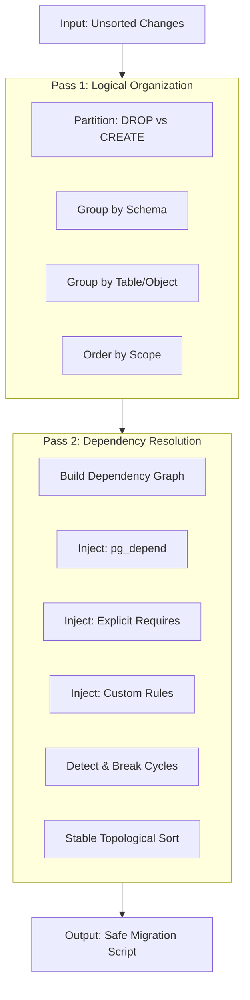

# Sorting Architecture & Algorithm

This document details the sorting engine responsible for generating safe, executable, and readable PostgreSQL migration scripts.

## The Mission

Generating a migration script involves two competing goals:

1.  **Correctness (The Database's Need)**: Statements must execute in a specific order to satisfy PostgreSQL's strict dependency tracking (e.g., you cannot create a table before its schema exists).
2.  **Readability (The Human's Need)**: Related changes should be grouped together (e.g., all changes to `public.users` should appear in one block), rather than scattered randomly based on graph topology.

We solve this with a **Hybrid Two-Pass Strategy**:
1.  **Logical Pre-Sort**: Organize changes for humans (Heuristic-based).
2.  **Topological Sort**: Re-order minimally for the database (Constraint-based).

---

## High-Level Pipeline

---

## Core Concepts

Before diving into the algorithm, it is crucial to understand the primitives we use.

### 1. Stable IDs ("The Rosetta Stone")
PostgreSQL uses OIDs (integers) to track objects, but these change between environments. We use **Stable IDs**—string representations of object identities—to link the database catalog to our code.

| Concept | Representation | Example |
|:--- |:--- |:--- |
| **Schema Object** | `type:schema.name` | `table:public.users`, `role:admin` |
| **Sub-entity** | `type:schema.parent.name` | `column:public.users.email` |
| **Metadata** | `scope:target` | `comment:public.users` |

Every `Change` object knows which Stable IDs it **creates**, **drops**, or **requires**.

### 2. Execution Phases
Migration operations fall into two distinct categories with opposite ordering rules:

*   **Destructive (DROP)**: Must run in **Reverse Dependency Order**.
    *   *Rule:* Drop the dependent (Foreign Key) before the dependency (Table).
*   **Constructive (CREATE/ALTER)**: Must run in **Forward Dependency Order**.
    *   *Rule:* Create the dependency (Table) before the dependent (Foreign Key).

---

## Examples

### Scenario 1: The Basic Dependency
*Database Rule:* You must create a Role before assigning it as an owner.

**Input:**
1. `CreateTable(posts)` (Requires: `role:admin`)
2. `CreateRole(admin)`

**Result:**
1. `CreateRole(admin)`
2. `CreateTable(posts)`

---

### Scenario 2: The Logical Grouping (Human Readability)
*Human Rule:* Keep the index near the table it belongs to.

**Input:**
1. `CreateTable(users)`
2. `CreateTable(posts)`
3. `CreateIndex(users_idx)` (on users)
4. `CreateIndex(posts_idx)` (on posts)

**Result (grouped by table):**
1. `CreateTable(users)`
2. `CreateIndex(users_idx)`
3. `CreateTable(posts)`
4. `CreateIndex(posts_idx)`

---

### Scenario 3: The "Custom Constraint"
*Business Rule:* `ALTER DEFAULT PRIVILEGES` must run before any tables are created, so they inherit the correct permissions. This is not a strict database dependency (the command would succeed anytime), but a logic requirement.

**Input:**
1. `CreateTable(users)`
2. `AlterDefaultPrivileges(...)`

**Result:**
1. `AlterDefaultPrivileges(...)`
2. `CreateTable(users)`

---

## Detailed Mechanics

### Pass 1: Logical Pre-Sorting

This pass groups changes to maximize readability. It does **not** verify dependencies; it assumes the "happy path" order.

**Sorting Hierarchy:**
1.  **Phase**: DROP changes first, then CREATE/ALTER.
2.  **Schema**: `public` stuff together, `auth` stuff together.
3.  **Object Hierarchy**:
    *   Parent Object (e.g., `Table`)
    *   Sub-entities (e.g., `Columns`, `Indexes`, `Triggers` linked to that table)
4.  **Scope**: `CREATE` -> `ALTER` -> `COMMENT` -> `GRANT`.

### Pass 2: Topological Sorting

This pass ensures correctness. It builds a Directed Acyclic Graph (DAG) where nodes are changes and edges are "must run before" constraints.

#### The Unified Constraint System
We normalize all forms of dependencies into a single `Constraint` interface.

| Source | Description | Complexity |
|:--- |:--- |:--- |
| **Catalog** | `pg_depend` data from the DB. (e.g., View depends on Table). | `O(N)` |
| **Explicit** | Code-defined requirements via `change.requires`. | `O(N)` |
| **Custom** | Logic rules (e.g., Default Privileges). Implemented as **Generators** using efficient lookups. | `O(N)` |

#### Cycle Detection & Breaking
Real-world schemas often contain cycles (e.g., Table A has a Foreign Key to Table B, and Table B has a Foreign Key to Table A).

**The Heuristic:**
1.  Detect the cycle.
2.  Identify if any edge in the cycle is "breakable" (a soft dependency).
    *   *Example:* A Foreign Key constraint is a soft dependency if we can separate it into a later `ALTER TABLE ADD CONSTRAINT`.
3.  Filter out the specific edge causing the lock.
4.  Re-sort.
5.  If the cycle persists (only hard dependencies remain), throw a detailed `CycleError`.

#### Inversion Logic
For the **DROP** phase, we simply **invert** the graph edges.
*   If `A depends on B`, normally `B` comes before `A`.
*   In DROP phase, `A` must be dropped before `B`.
*   The algorithm handles this by flipping `source` and `target` indices during edge construction.
